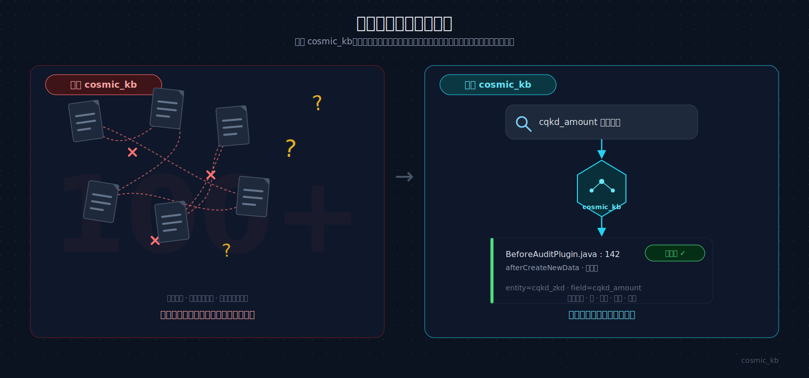
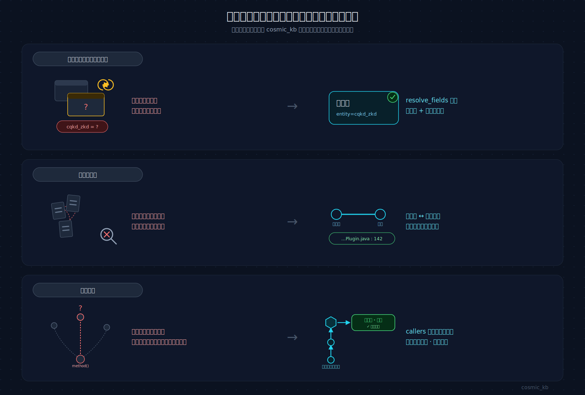
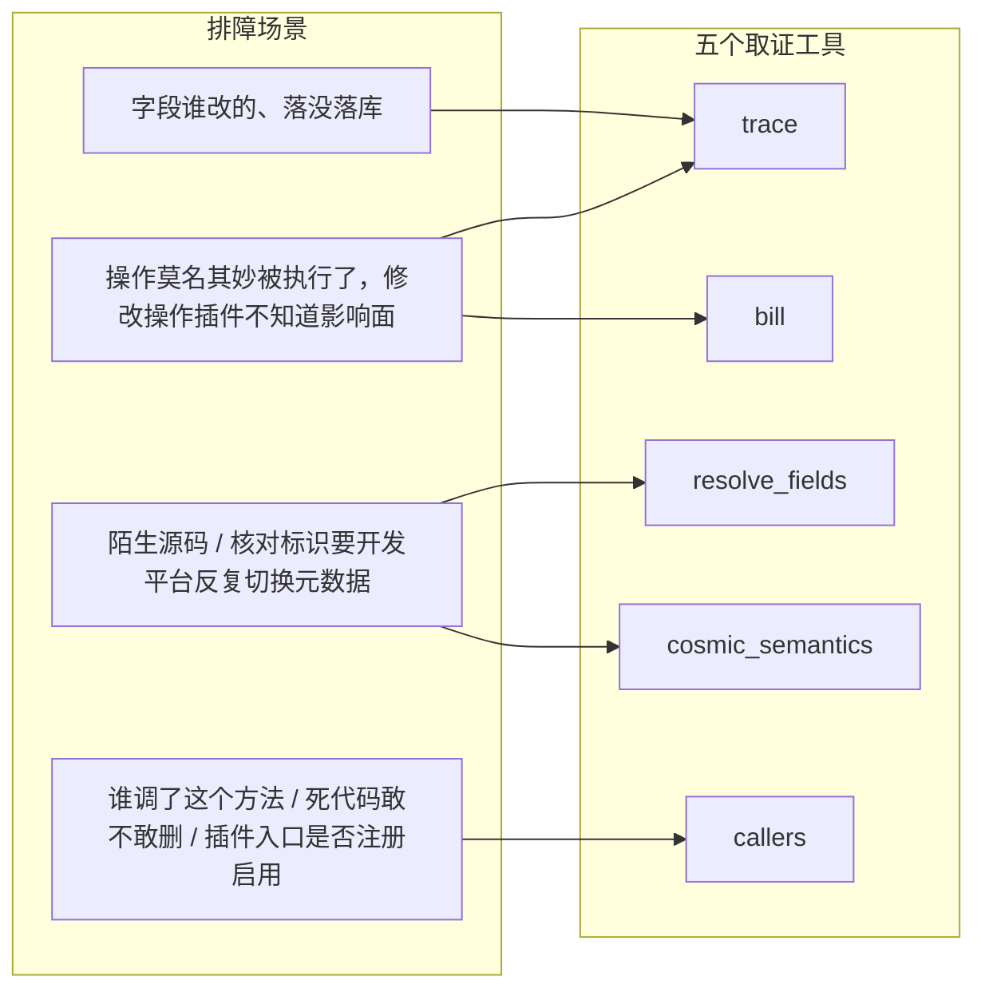
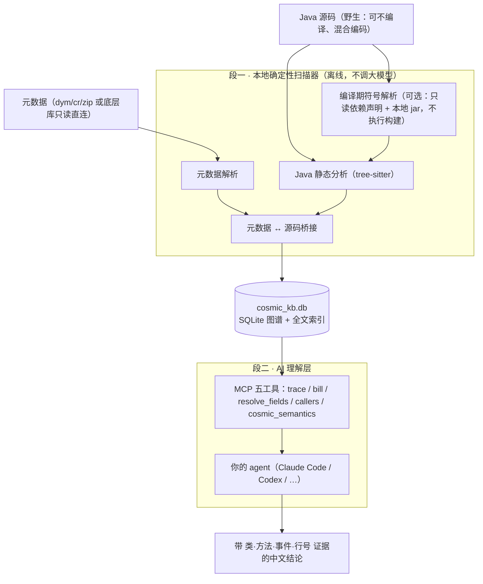
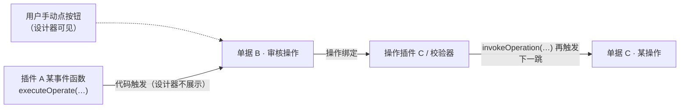

# cosmic_kb —— 苍穹老项目本地排障导航工具

> 指向陌生金蝶云苍穹（Cosmic）老项目的源码 + 元数据，**纯本地扫一遍**建成知识库（KB）；
> 之后你的 AI agent（Claude Code / Codex / CodeBuddy / Qoder / Trae …）接上 KB，就能回答
> 「这字段谁改的、在哪个插件哪个事件、落不落库、源码第几行、这个方法谁在调」——**所有结论带证据行号，判不准标 `unknown`，绝不臆造**。纯本地运行、不外传源码。



> 从「翻源码、切设计器、猜字段」，到「一次提问，拿到可追溯证据链」。

## 目录

- [解决什么痛点](#解决什么痛点)
- [能做什么](#能做什么)
- [什么原理](#什么原理)
- [怎么安装](#怎么安装)
- [装完怎么验证](#装完怎么验证)
- [怎么用（含重建-kb）](#怎么用含重建-kb)
- [更多文档](#更多文档)

## 解决什么痛点

没有本工具时，接手陌生苍穹老项目排障要硬扛这些坑：



**元数据与苍穹私有框架侧**

- **字段英文标识大模型只能按拼音瞎猜**（真实翻车：「转款单」被大模型猜成「转账单」），下拉枚举 `1`/`2`有啥含义、基础资料引用哪张单更是瞎蒙，人工排查又要开发平台来回切元数据。
- **通用大模型没学过苍穹私有框架**（`AbstractBillPlugIn`、`afterCreateNewData`、`BusinessDataServiceHelper`…），只能套普通 Java 经验硬猜，猜错还不自知。
- **插件绑定关系分散在设计器三处页面**，来回切视图才能拼起「这单据到底干了什么有啥插件？」。

**源码搜索侧**

- **跨单据间接写入元数据翻不出** → 只能全局搜源码，几十个插件翻到崩溃。
- **单据标识魔法值/常量混用** → 关键字搜都搜不全，各种标识散落各处，翻到崩溃。

**调用链侧**

- **操作被别处代码 `executeOperate`/`invokeOperation` 程序化触发，设计器压根不展示这条调用关系** → 排查「没人手动点操作，操作插件怎么触发了」只能全局搜代码里谁调用了这个操作。
- **方法调用链长/多处引用修改影响面需要人肉排查**：遇到要修改高频调用方法时，IDEA展示调用位置一大页，还要手工排查每个调用链，找到插件入口，插件看不到是否注册，还要设计器逐个页面核对。
- **同名方法/同名类混作一团**：一个方法名在多个类各有一份定义、项目内自定义类又和平台 jar 里的类重名，纯文本搜索分不清谁调的是谁，误报连片。
- **死代码不敢删**：「全局没搜到调用」不等于「真的没有调用」——搜索写严了漏方法引用、写松了满屏噪音，缺一个能给出覆盖率证据的反查手段；就算搜到了调用链，也不知道链顶那个插件类到底有没有在元数据里绑定单据/操作、绑定了是否启用，只能再去设计器里逐个页面核对。

## 能做什么

核心四件事，对应老项目排障最常见的四个场景：

- **① 字段级排障**：字段出了问题（谁改的、落没落库），直接查 KB 拿到「插件/方法/事件/是否落库/源码行号」完整证据链，不用自己翻元数据、逐个肉眼全局**拼源码**。
- **② 操作触发链排障**：单据状态莫名其妙变了、操作明明没人手动点却执行了——查 KB 拿到「谁在代码里 `executeOperate`/`invokeOperation` 触发了这个操作、它又触发了谁」完整触发链，补上**设计器压根不展示**的隐藏调用关系，不用全局搜代码硬找。
- **③ 源码解析核对**：拿到一段陌生苍穹源码/插件类，核对它绑在哪个单据哪个操作、代码里的英文字段标识对应真实中文名、用到的苍穹私有插件类型/事件时机/SDK 是什么用法——防止大模型套普通 Java 经验硬编业务逻辑。
- **④ 调用链反查 / 死代码判定**：验证一条调用链、或判断某个方法是不是死代码——`callers` 一次列出该 Java 方法的**全部静态调用点**（含全局搜方法名根本搜不到的 `Class::method` 方法引用），0 结果时附符号覆盖率说明「查无调用方」的证据强度；更进一步，`callers` 会自动沿调用链**一路回溯到最终的插件事件入口**，再反查元数据**是否绑定了单据/操作、绑定是否启用**——三种苍穹真实场景一次说清：入口已注册且启用（大概率真被平台调用）、入口已注册但被禁用/查无绑定（疑似不可达，但不排除反射等动态触发，不武断下死代码结论）、入口种类 KB 未接入注册表（如调度计划/开放平台/工作流，如实报「无法确定」）。不再让 agent 手写全局 Grep 搜漏，也不再靠人工翻插件绑定表核对启用状态。

遇到的问题该找哪个工具，一图对上：



五个取证工具（**不调大模型、不下结论**，只产确定性证据，讲成人话靠你接的 agent）：

| 工具 | 作用 |
| --- | --- |
| `trace "单据.字段"` | 一次列出所有读写它的插件/方法/事件/是否落库/源码行号；加 `--kind operation` 改查 `trace "单据.操作key"`，返回该操作的程序化触发链（谁在代码里 `executeOperate`/`invokeOperation` 触发了它、它又触发了谁），补上设计器不展示的隐藏调用关系 |
| `bill "单据标识"` | 一次列出表单插件/操作集/每个操作绑定的插件；`operations[].programmatic_trigger_count` 非零即提示该操作存在代码触发，可转上面的 `trace --kind operation` 深挖 |
| `resolve_fields` | 把字段/分录/单据英文标识核对成真实中文名 + 元数据定义（层级、类型、枚举中文、基础资料指向） |
| `callers "Class.method"` | 反查该 Java 方法的全部静态调用点（含 `Class::method` 方法引用），每条带行号/调用类型/解析来源/置信度；0 结果附符号覆盖率，覆盖足才敢标「查无调用方」；简单类名跨包重名会反问，不按调用数猜选。**并自动回溯到插件事件入口，反查元数据是否绑定单据/操作及是否启用**（`entry_analysis`），给出「已注册且启用可达 / 已注册但禁用或未注册疑似不可达 / 该类插件 KB 未接入注册表无法确定」三态判定，不武断断言死代码 |
| `cosmic_semantics` | 查权威文档核对苍穹私有插件类型、事件触发时机、原厂 SDK 用法、入库规则、反模式 |

> 每个工具返回字段的详细含义见 [`返回值字段词典`](docs/参考手册/返回值字段词典.md)。

## 什么原理

**两段式解耦，KB 是契约：**



1. **段一·本地确定性扫描器**：指向 Java 源码 + 元数据（dym/cr/zip 或直连底层库只读现取），本机离线扫一遍，把元数据事实、Java 字段级读写、跨类调用图、苍穹领域语义**一起解析进同一份 KB**（`cosmic_kb.db`，SQLite 图谱 + 全文索引）。不调大模型、不依赖代码可编译。
2. **段二·AI 理解层**：你的 agent 通过 MCP 直调上面五个工具查 KB，带**类·方法·事件·行号**证据作答。

**精度分级（编译期符号解析）**：段一分析跨类调用时**优先做编译期类型绑定**——只读工程自带的依赖声明（IDEA `.iml` / 金蝶官方 Gradle 模板）+ 绑定本地 jar，**不执行任何构建**（不跑 mvn/gradle/javac），就能把绝大多数跨类调用点钉到唯一的声明类与方法签名：项目内同名方法/同名类彻底消歧、`Class::method` 方法引用不再漏、平台 jar 的同名类不再误认。解不出的退回 tree-sitter 名字匹配，**每条证据都标注解析来源**（`symbol`/`heuristic`），可逐条审计。符号层只需要本机有 java 8+ 运行时（运行随包的解析小工具，不碰你的项目构建）；没有 java 也不失能，整体软降级回名字匹配并如实标注。量化提升与能力边界详见 [`编译期符号解析能力总结`](docs/核心/阶段12工具能力提升总结.md)。

以「操作触发链」为例，KB 里补上的正是设计器不展示的那条边：



派生哲学：**处处置信度 + 证据行号 + unknown**——判得准标 `confirmed`，判不准标 `unknown`，绝不臆造。

> 为什么接 agent 而不自己看返回：`trace` 命中多坐标时一次就是几十条 JSON，肉眼扫读累且易漏；让 agent 调工具、读证据、组织成中文结论最省事——所以下面以「接上 agent」为默认路径。

## 怎么安装

对话式一条龙。**把下面这段版本固定的「安装口令」整段发给你的 agent**（Claude Code / Codex CLI / CodeBuddy / Qoder…），它会用用户级隔离运行时装好固定版本包，再跑 `bootstrap` 完成**装工具 → 建 KB → 注册 MCP → 校验工具**；你只在它反问时确认参数、在终端隐藏输入数据库口令：

<!-- INSTALL-TOKEN:START —— 由 scripts/make_dist.ps1 按版本自动生成，请勿手改 -->
```text
请为当前项目安装并初始化 cosmic-kb==0.2.1。
1) 仅从 https://pypi.org/simple 安装，用 %USERPROFILE%\.cosmic_kb\runtime 用户级隔离环境（不污染系统 Python / 项目 venv）；缺 Python 3.10+ 先征得我同意再装，无 winget 则停止并给我官方安装入口。
2) 装固定版本 cosmic-kb[complete]（含 parse/encoding/mcp/postgres）。
3) 运行该环境里的 cosmic_kb bootstrap plan --project "<当前项目根>" --agent auto --json，把返回的 questions 逐条问我确认。
4) 我确认后运行 cosmic_kb bootstrap apply（按 plan 的参数）：写安装清单 → 装 Skill → 建 KB → doctor → 注册 MCP → 校验 trace/bill/resolve_fields/callers/cosmic_semantics 五工具。
5) 若直连底层库取元数据，加 --db-config 与 --prompt-db-password：数据库口令只能在终端隐藏输入，绝不要我贴进对话，也不写进任何命令/配置/日志。
6) apply 完成后提醒我重启 / 重连 Agent 使 MCP 生效。
```
<!-- INSTALL-TOKEN:END -->

口令里的版本号随每次发版自动写入，始终与包版本一致；`bootstrap apply` 幂等可断点续跑，已做步骤自动跳过。

> **国内慢/超时**：照发口令，只在开头补一句「把其中的 `https://pypi.org/simple` 换成清华镜像 `https://pypi.tuna.tsinghua.edu.cn/simple`」即可。
> **手动装 / 纯内网离线 / 数据库口令与图形化客户端（Qoder·Trae）粘 MCP 两处例外** → 见 [`手动安装详细教程`](docs/参考手册/手动安装详细教程.md)、[`接入 agent 与 MCP`](docs/参考手册/接入agent与MCP.md)。

## 装完怎么验证

三种方式确认「KB 已建、MCP 已注册、工具可用」：

- **看 `bootstrap apply` 收尾**：它自带 doctor 资产自检 + 子进程校验取证工具，全报 `done` 即通过。
- **`cosmic_kb bootstrap status`** 看各步是否全绿；**`cosmic_kb doctor`** 单独做一次资产体检。若本机没有 java，doctor 会提示「符号解析将降级」——这不算失败，KB 照建，只是跨类调用退回名字匹配精度。
- **最直观**：重连 agent 后，用中文问一句带字段的业务问题（如下），看它能否调 `trace` 返回带行号的证据。

## 怎么用（含重建 KB）

装完日常用法就一句话：**像平时那样用中文问你的 agent，不用背命令**——它会自己判断该调哪个工具、把证据读成人话。举例：

**① 字段级排障**

```text
cqkd_zkd 这张单的 cqkd_amount 字段是谁改的？改完落库了吗？在源码第几行？
```

**② 操作触发链排障**（设计器不展示的隐藏坑：代码里程序化触发操作）

```text
cqkd_zkd 这张单的审核操作，除了人手动点审核按钮，还有没有别的代码在触发它？触发链是怎样的？
```

**③ 核对陌生源码**（把看不懂的插件源码或英文字段标识丢给 agent）

```text
这段代码在干什么？里面的 cqkd_zkd、srctransid 是什么字段？这个插件绑在哪个单据的哪个操作上？afterCreateNewData 什么时候触发？
```

**④ 摸清一张单据**

```text
cqkd_zkd 这张单据都绑了哪些插件？每个操作（提交/审核/…）分别触发哪些插件？
```

**⑤ 调用链反查 / 死代码判定**

```text
ContractService 的 updateRlateAssets 方法都有谁在调？包括 :: 方法引用的写法。这个方法能安全删掉吗？
```

**实用提醒：**

- **源码/元数据更新后重建 KB**：让 agent 重跑一次 `cosmic_kb bootstrap apply`（幂等，已建步骤自动跳过），或直接说「源码更新了，帮我重建 KB」——`trace`/`callers` 的调用关系要重建后才反映最新代码。
- **MCP 改动/重装后**要**重启或重连 agent** 才生效。
- **想自己在终端查、不经过 agent**：全部命令见 [`命令行速查`](docs/参考手册/命令行速查.md)（`cosmic_kb --help` 看全部）。

## 更多文档

- [`手动安装详细教程`](docs/参考手册/手动安装详细教程.md) —— 不接 agent 的完整手动安装（venv/pip/可选组/常见报错）
- [`建库与更新详解`](docs/参考手册/建库与更新详解.md) —— 直连底层库 / dym-zip 建库、增量重扫与更新逻辑
- [`接入 agent 与 MCP`](docs/参考手册/接入agent与MCP.md) —— 各宿主 MCP 配置写法、接好后怎么问、一键装 Skill
- [`命令行速查`](docs/参考手册/命令行速查.md) —— 不接 agent 时自己用命令行查（建库/查库全命令）
- [`返回值字段词典`](docs/参考手册/返回值字段词典.md) · [`trace 返回详解`](docs/参考手册/trace返回详解.md) —— 每个工具返回字段含义 / `trace` 完整 vs 截断推演
- [`编译期符号解析能力总结`](docs/核心/阶段12工具能力提升总结.md) —— 符号层带来的量化提升、新覆盖场景与诚实边界
- [`V0.2.1 发版说明`](docs/核心/V0.2.1发版说明.md) —— 修正操作触发链误识别并补充识别边界说明
- [`V0.2.0 发版说明`](docs/核心/V0.2.0发版说明.md) —— 新能力总览、schema v20 升级与 KB 重建提醒
- [`分发给同事`](docs/参考手册/分发给同事.md) · [`发版流程`](docs/参考手册/发版流程.md) —— 打包分发 / 发新版本全流程
- [`CLAUDE.md`](CLAUDE.md) · [`开发计划`](docs/核心/开发计划.md) · [`阶段验收`](docs/核心/阶段验收.md) —— 设计红线、两段式架构、分阶段蓝图与验收
- [`分发与多 agent 接入方案`](docs/设计方案/分发与多agent接入方案.md) · [`cosmic_kb/skills`](cosmic_kb/skills) —— 对话式安装/跨 agent 接入设计 / 随 wheel 分发的 Skills
