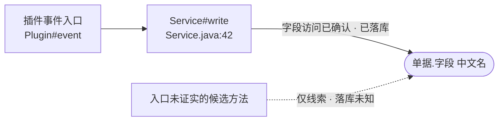
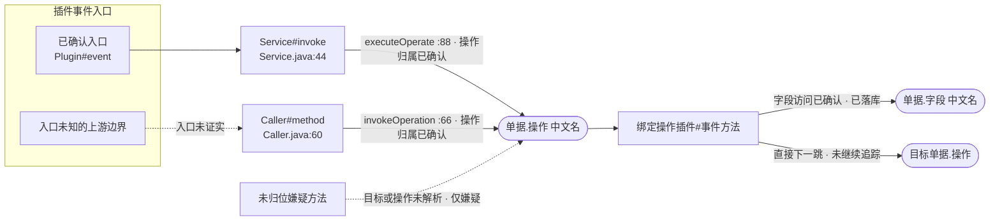

# Cosmic KB 项目理解

理解既有苍穹项目，不默认生成业务代码。使用 `cosmic_kb` MCP 获取确定性证据，读取本地源码补全上下文，并把结果整理成可复核的业务结论。

## 核心纪律

1. 先取证，后结论。不要按字段名、类名、包名或训练记忆猜测中文名、绑定关系、事件语义和保存结果。
   源码里的中文注释、常量名、Javadoc 只是开发者当年的说法，**不是元数据证据**，同样不得替代
   `resolve_fields` 核对——“注释里写了中文名”不构成跳过核对的理由。
2. 为每个判断标记置信度并说明依据：内部对应工具的 `confirmed`/`likely`/`unknown`，
   输出给用户时一律写成中文“已确认”“可能”“未知”（见后文“术语对照”），没有证据时明确写“未知”。
3. 通过 MCP 查询字段、单据、插件绑定和苍穹语义；直接读取本地源码全文，保留文件和行号。不要把源码、KB 或报告上传到公网站点。
4. 不要默认生成或改写 Java 业务代码。用户明确要求修改时，再把已确认的理解作为修改依据。
5. 把 `kd.bos.*`、`SaveServiceHelper` 等未知平台符号视为外部 SDK，按需调用 `cosmic_semantics` 核实，不要当成本项目缺陷。
6. 工具返回冲突、歧义或信息不足时不要自行挑选答案；缩小标识范围重新查询，仍无法确认则保留存疑。

## 工具使用原则

以 MCP 当前 schema、description 和 server instructions 为参数事实源，不在本 Skill 复制完整签名。按已知起点路由：

| 已知起点或问题 | 首选工具 |
|---|---|
| 精确字段坐标；谁读写、插件事件入口链、落库证据 | `trace(kind="field")` |
| 精确操作坐标；绑定插件、程序化上游（含回溯到插件事件入口的 `entry_chains`）、未解析入站、跨单据下游 | `trace(kind="operation")`，不先调 `bill` |
| 单据整体操作集、全部插件、插件车道、本单据插件对外触发的影响面(outbound_triggers) | `bill` |
| 字段/实体/单据标识或插件类名反查 | `resolve_fields` |
| 谁调用了某 Java 方法、方法引用位置、死代码验证 | `callers`；简单类名歧义时按 candidates 改传完整 FQN |
| 插件事件、SDK、DynamicObject、事务和入库语义 | `cosmic_semantics` |

- **强制门**：每读完一份源码、在写任何结论之前，先列出其中全部尚未核对的字段/实体/单据标识，
  批量调用 `resolve_fields`。不因“常量类带中文注释”“命名一看就懂”而跳过；MCP 已返回精确坐标
  （含中文名）的标识无需重复解析。
- `trace`、`bill` 或 `callers` 返回 `pagination.complete=false` 时，按返回的 next_cursor 查询至 `complete=true`。
- 出现 `need_clarification`、`mismatched_*`、`invalid_request` 时，按候选或真实归属修正参数。
- 出现 `coarse_only`、`unlocated`、`dynamic_writers`、`unresolved_inbound`、未绑定源码类或动态字段时，读取对应源码并单列仍无法确认的部分；这些状态不等于“不存在”。

## 工作流

### 建立项目全貌

1. 确认 KB 和 MCP 已可用；若不存在、版本不符或未连接，停止取证并转用 `cosmic-kb-setup`。
2. 用户需要项目地图时，运行 CLI-only 的 `cosmic_kb report map`。
3. 用户需要规模、排障入口或风险热点时，运行 CLI-only 的 `cosmic_kb report overview`。
4. 从用户关注的模块、单据、字段或插件进入下列单点工作流，不要仅凭全貌报告推断字段行为。

### 字段追溯

1. 从源码上下文识别可能的单据、实体和字段坐标。
2. 用 `resolve_fields` 批量核对本轮出现的陌生标识；确认中文名、主实体/分录/子分录/基础资料路径，以及枚举或引用语义。
3. 用已确认的最精确坐标调用 `trace(kind="field", access="write")`，默认先查全写侧；存在歧义时按候选
   重新查询，不要把裸字段的多个归属合并成一个结论。只有用户明确询问读取或完整读写关系时，才再
   单独调用 `trace(kind="field", access="read")`，不要为了展开默认读取概览而无条件增加一次查询。
4. 对本次启用的每个访问侧，按顶层 `pagination.pending` 逐项翻页至 `complete=true`；把首页及
   `entry_chains` 分页中的目录项合并成索引，再用访问节点的 `entry_ref` 关联“插件事件入口 →
   service/helper → 实际访问方法”。不得只报最终 set/get 行，也不得在每个源码行下重复整条入口链。
5. 按 `entry_ref`（缺失时按物理类+方法）去重输出：同一方法只列一次，合并访问次数，最多列 3 个
   代表源码锚点，其余写“另有 N 处”。`entry_chains` 中没有被任何访问节点引用的条目单列为
   “已发现入口方法，但没有精确字段访问行”，不得冒充确切读写，也不得静默省略。
6. 分开判断三个维度，不要互相替代：字段访问是“已确认/可能/仅线索”；插件入口是“已确认/可能/
   未知”；写入结果是“已落库/仅内存/未知”。入口未证实不等于字段访问未证实，精确 set 也不自动
   等于已经落库。
7. 读取每个去重写入方法的完整源码；用户明确查读取时，同样读取去重后的读取方法。把 `possible`、
   `unlocated`、`dynamic_writers`、`coarse` 分别整理为“层级/分录可能命中”“来源单据未定位”
   “动态字段写入候选”“粗粒度源码命中”四类工作单，不混进确切写入表。
8. 若 `note` 提示操作插件存在程序化触发，在“关联操作”中列操作坐标和触发点计数；只有用户追问
   上游原因时才继续调用 `trace(kind="operation")`，不要让字段结论被无关的操作明细撑大。
9. 按“字段排障结论”模板输出，并始终附字段调用 Mermaid 图。

### 插件或方法解释

1. 用户问“谁调用了这个方法”或要验证死代码时，先用 `callers`；翻看每条 resolution 与顶层
   `resolution_coverage`，符号层不可用/覆盖不足时不得把 0 结果断言成死代码。
2. 只有插件类名时，先用 `resolve_fields(kind="plugin")` 反查绑定；需要完整单据上下文时再调用 `bill`。
3. 核对绑定单据、操作和启用状态。`enabled=null` 只表示未确认，不要解释为已禁用。
4. 已确认具体操作时，用 `trace(kind="operation")` 补充绑定插件、程序化上游、未解析入站和跨单据下游；不要无理由先调 `bill`。
5. 读取插件源码，定位触发方法、条件分支、字段读写和项目内服务调用。
6. 把源码中新出现且尚未核对的字段、实体和单据标识批量交给 `resolve_fields`。
7. 对不确定的插件事件、SDK 或保存语义调用 `cosmic_semantics`，再按“插件/方法作用解释”模板输出。

### 操作影响分析

1. 已知 `单据.操作key` 时，直接调用 `trace(kind="operation")`，不把 `bill` 当前置步骤。
2. 出现错误或 `need_clarification` 时先修正坐标；正常返回后，保存首页的 `plugins`、`operation` 和
   `summary`，再对首页 `pagination.pending` 中每个 section 分别翻页到 `next_cursor=null`，合并
   `triggered_by`、`unresolved_inbound`、`triggers_downstream` 全部条目后才下结论。
3. 把 `triggered_by` 视为“已确认指向本操作的程序化调用”，把 `unresolved_inbound` 视为“无法静态
   排除的嫌疑”，两者不得混成同一置信度；两段合起来才是本次静态分析可见的程序化入站全貌，空结果
   只能写“未发现程序化代码触发证据”，不能写“本操作不会执行”。
4. 按 `(caller_class, caller_method)` 去重入站：同一方法只列一次，合并调用次数/方式，最多列 3 个
   代表源码锚点，其余写“另有 N 处”；同一方法内联的相同 `entry_chains` 只展开一次。`caller_forms`
   只是调用方插件绑定的上游单据线索，不得据此虚构上游操作坐标。
5. 分开判断“操作归属”和“插件入口”：`triggered_by` 的操作归属已确认，但其 `entry_chains` 仍可能
   只到插件类、静态追不到上游或被搜索上限截断；入口未证实不降低直接调用点本身的确定性。只有
   `terminal=entry` 才写“入口已确认”，`plugin_boundary` 写“可能入口”，其他终止原因写“入口未知”。
6. 将 `unresolved_inbound` 按成因分成三类工作单并保持原强弱顺序：目标单据已确认但操作 key 解不出；
   操作 key 匹配但目标单据解不出；操作与目标都解不出。逐个读取去重后的触发方法源码，不把嫌疑写成
   已确认调用，也不为挂不上操作坐标的表单插件外发再补查 `bill`。
7. 根据 `plugins` 读取每个去重操作插件的完整源码，确认启用状态、事件/事务相位、条件分支和字段读写；
   批量 `resolve_fields` 核对标识，再对实际涉及字段调用 `trace(kind="field", access="write")` 核对
   字段访问与入库。操作名称、插件绑定或调用 API 本身都不是字段已落库证据。
8. `triggers_downstream` 默认只汇总本操作到目标操作的直接下一跳：`next_trace` 非空表示目标坐标已
   定位，仍不代表完整下行链。只有用户要求完整级联或指定某条下游时，才沿 `next_trace` 逐跳查询，
   记录已访问坐标避免循环；目标或操作未解析的条目保留为风险，不补猜坐标。
9. 只有需要单据整体操作集、全部插件车道或本单据插件对外触发的影响面（`outbound_triggers`）时，
   才补充调用 `bill`；操作 key 或目标单据解不出的入站嫌疑（含挂不上操作坐标的表单插件外发）已
   并入 `trace(kind="operation")` 的 `unresolved_inbound`，对该操作的调用查一次即完整，不必为此
   再补查 `bill`。
10. 按“操作影响分析”模板汇总并始终附 Mermaid 图；图和文字都按方法/操作坐标去重，不逐源码行
    重复入口链或下游节点。

## 术语对照（工具内部标识 → 用户可读表达）

MCP 工具返回的英文状态码、字段名（`status`/`terminal`/`resolution` 等取值）是给程序判断用的，
**不是给用户看的**。写最终结论前，把下表左侧标识翻译成右侧中文表达；**<font color=red>禁止</font>**把 `self_entry`、
`no_static_caller`、`plugin_boundary` 这类原始标识原样写进输出给用户看到的文字或 mermaid 图。

| 工具内部标识 | 用户可读表达 |
|---|---|
| `status: self_entry` | 该操作/方法本身就是插件事件入口，无需再回溯 |
| `status: reached` | 已回溯到至少一条插件事件入口 |
| `status: boundary_only` | 只追到插件类，事件方法未确认 |
| `status: not_found` | 没能追到任何入口 |
| `terminal: entry` | 已到达插件事件入口 |
| `terminal: plugin_boundary` | 已到达插件类，但方法未登记为平台事件（任务/工作流类插件常见），按“可能是入口”处理 |
| `terminal: no_static_caller` | 找不到静态调用来源，可能是反射调用、定时任务、对外接口等动态触发方式，入口未证实 |
| `terminal: depth_capped` | 回溯层数已达上限，尚未追到入口 |
| `terminal: callers_all_visited` | 调用路径出现环，或已在其他链路里探索过，未再展开 |
| `search_truncated` | 调用关系图较大，本次搜索未完全展开 |
| `chains_truncated` | 还有更多触发链未在本次结果中展示 |
| `resolution: expr / scope` | 精确解析（可信） |
| `resolution: heuristic` | 启发式匹配（不够精确，结论需降级为“可能”） |
| `confidence: confirmed / likely / unknown` | 已确认 / 可能（间接证据） / 未知（证据不足） |
| `unresolved_inbound` | 疑似触发，但来源未确认 |
| `triggers_downstream` / `next_trace` | 触发的下游操作（只到下一跳，非完整级联链） |
| `outbound_triggers` | 本单据插件对外触发的下游操作（影响面视图） |
| `programmatic_trigger_count` | 被程序化调用的次数（用于发现有没有入口，不是完整调用面） |
| `coarse_only` | 只有粗粒度证据（源码字面量匹配），未做到字段级精确定位 |
| `unlocated` | 没能定位到具体的读写代码位置 |
| `dynamic_writers` | 疑似通过动态拼接/循环写入，字段 key 无法静态钉死 |
| `resolution_coverage` | 方法名到源码符号的解析覆盖率（决定查无结果是否可信） |
| `need_clarification` | 标识有歧义，需要更精确的坐标 |
| `mismatched_form` / `mismatched_kind` | 标识与查询条件不匹配 |
| `invalid_request` | 参数不合法 |

## 回答格式

遵循“结论 → 证据 → 存疑 → 下一步”。省略与问题无关的栏目，但不要省略会改变可信度的存疑信息。
所有面向用户的文字和 mermaid 图必须用上表把工具内部标识转换成中文表达，不出现原始英文状态码。

**中文名来源硬约束**：输出中出现的每个字段/实体/单据中文名，都必须来自 `resolve_fields` 或其他
MCP 工具的返回；来不及或无法核对的，只准写成 `<标识>（⚠️未核对）`，不得把源码注释、常量名或
自行推断的名字直接填进模板。

### 字段排障结论

````markdown
字段：<单据.实体.字段>（<中文名>）｜路径：<主实体/分录/子分录/基础资料>
查证范围：写侧=<已取全/未取全及原因>｜读取=<仅总量概览/明细已取全>｜分页=<已完成/未完成>

结论：<确切写入方法数、落库情况、读取总数及最影响判断的疑点；先说结果，不复述原始 JSON>

### 写入证据（按入口/物理方法去重）
| 编号 | 字段访问 | 插件入口 | 入口链 → 实际写入方法 | 源码锚点 | 入库结果 |
|---|---|---|---|---|---|
| W1 | <已确认；可能/仅线索放下方工作单> | <已确认/可能/未知及原因> | <事件入口 → service/helper → 类#方法> | <file:line，最多3处；另有N处> | <已落库/仅内存/未知及依据> |

间接入口：<entry_chains 中未被访问节点引用的入口方法；没有写“无”。只说明没有精确字段访问行>

### 存疑工作单
- 层级/分录可能命中：<possible + 入口编号/链 + 源码锚点；没有写“无”>
- 来源单据未定位：<unlocated + 入口编号/链 + 原因 + 源码锚点；没有写“无”>
- 动态字段写入候选：<dynamic_writers + 入口编号/链 + 动态成因；没有写“无”>
- 粗粒度源码命中：<coarse + 源码锚点；没有写“无”>

读取结果：<默认只写 summary.readers 总量并注明未展开；明确查读取时，另附“编号｜字段访问｜插件入口｜
入口链 → 实际读取方法｜源码锚点”的去重读取证据表，不写入库列>
关联操作：<程序化触发提示中的操作坐标和计数；没有写“无”。未追 operation 时明确尚未展开上游>
能力边界：<只写本次分页、入口截断、动态解析等真实存在的边界；没有写“无”>
下一步建议：<具体到待查操作坐标、字段、方法或源码位置；证据已闭环则写“无需继续查证”>
````

字段追溯文字模板之后**必须**附 Mermaid 图，即使本次没有确切写入。图只负责表达关系，完整计数和
源码锚点仍以文字表为准：

````markdown

````

字段作图规则：
1. 节点和边只来自已取回的 `entry_chains`、访问节点和已读源码；不根据类名或方法名补画调用关系。
2. 每个去重的入口/访问方法只画一个节点，不为同一方法的每个源码行建节点；多个锚点放回文字表。
3. 分别表达入口链与字段访问的确定性：入口未证实时，只把入口到访问方法的边画成虚线；字段访问
   本身已确认时，访问方法到字段仍用实线，避免把两种确定性混为一谈。
4. 访问方法到字段的边标签写“字段访问确定性 · 入库结果”；可能命中或仅线索用虚线并写中文原因。
5. 未被访问节点引用的间接入口可放在独立 subgraph，但不得连到字段节点；没有确切写入且存在真实
   候选时只画候选虚线，没有任何候选时放一个“本次未发现写入证据”的独立说明节点，不虚构因果边。
6. 单图超过约 20 个节点时按访问类或证据等级拆成多图，不把所有源码行塞入一张图。

### 插件/方法作用解释

```text
类：<全限定名>｜绑定：<单据/操作/启用状态>

结论：<业务作用及触发事件>

写入字段（按置信度排序；没有则写“无”）：
  ✅ 已确认  <字段标识（中文名）｜路径>  行号=<file:line>  依据=<保存或事务证据>
  ~  可能    <字段标识（中文名）｜路径>  行号=<file:line>  依据=<间接证据>
  ?  未知    <字段标识（中文名）｜路径>  行号=<file:line>  原因=<缺失证据>

读取字段：<相关时列出>
调用的项目内方法/服务：<目标类或服务；没有写“无”>
未定位/存疑：<绑定、动态路径、事件或保存链路问题；没有写“无”>
风险点：<有证据支持的风险；没有写“无明显风险”>
下一步建议：<具体查询或源码位置>
```

### 操作影响分析

````markdown
操作：<单据.操作key>（<中文名/类型；不在元数据操作集时明确写“操作本体不可考”>）
查证范围：程序化入站=<已取全/未取全>｜未归位嫌疑=<已取全/未取全>｜下游=<仅直接下一跳/已继续追踪>｜分页=<已完成/未完成>

结论：<是否存在已确认程序化调用、主要插件执行影响、是否外发下游及最影响判断的疑点>

### 操作本体与执行插件
| 插件 | 绑定/启用状态 | 事件或事务相位 | 源码位置 | 已核对影响 |
|---|---|---|---|---|
| <类名> | <已绑定；启用/停用/未知> | <事件方法/相位> | <file:line> | <字段写入或业务动作摘要> |

### 已确认的程序化入站（按调用方法去重）
| 编号 | 操作归属 | 插件入口 | 入口链 → 直接触发方法 | 调用方式/源码锚点 | 上游单据线索 |
|---|---|---|---|---|---|
| I1 | 已确认 | <已确认/可能/未知及原因> | <事件入口 → service/helper → 类#方法> | <调用 API/方式；file:line，最多3处；另有N处> | <插件绑定的单据列表；只作线索> |

### 未归位入站嫌疑
- 目标单据已确认、操作 key 解不出：<方法、入口链、调用方式、源码锚点；没有写“无”>
- 操作 key 匹配、目标单据解不出：<方法、入口链、调用方式、源码锚点；没有写“无”>
- 操作与目标都解不出：<方法、入口链、调用方式、源码锚点；没有写“无”>

### 执行影响字段
| 字段 | 执行插件/方法 | 字段访问 | 入库结果 | 源码锚点 |
|---|---|---|---|---|
| <精确字段坐标> | <类#方法> | <已确认/可能/仅线索> | <已落库/仅内存/未知及依据> | <file:line> |

### 下游操作（每条仅为直接下一跳）
| 目标操作 | 发起方法/锚点 | 目标解析 | 追踪状态 |
|---|---|---|---|
| <目标单据.操作或“目标未解析”> | <类#方法；file:line> | <已定位/未知及原因> | <仅下一跳；继续查询坐标=.../已继续追踪> |

能力边界：<说明这是静态程序化调用证据，不是运行时执行次数；再列本次真实出现的入口中断、解析未知、
分页或搜索截断。没有具体中断时，不照抄示例去泛列反射/任务/工作流等未出现类别>
下一步建议：<具体到待读方法、待 trace 字段或继续查询坐标；下游非空但未递归时明确提醒当前只到下一跳>
````

操作影响文字模板之后**必须**附 Mermaid 图。图只表达已核对关系，计数、候选成因和多个源码锚点
保留在文字表中：

````markdown

````

操作作图规则：
1. 数据只来自合并后的 `triggered_by`、`unresolved_inbound`、`plugins`、字段 trace、
   `triggers_downstream` 和已读源码；不按方法名或操作名补画关系。
2. 每个去重调用方法、入口方法、操作坐标、执行插件和字段只画一个节点，不为每个源码行重复建点。
3. 分别表达两种确定性：入口未证实时，只把入口到调用方法的边画成虚线；直接调用已在
   `triggered_by` 时，调用方法到本操作仍用实线。未归位嫌疑到本操作一律用虚线并写中文成因。
4. 本操作到已绑定且启用的操作插件用实线；停用或启用状态未知时在节点中明确标注，不画成已执行。
   插件到字段的边沿用字段模板的“字段访问确定性 · 入库结果”标签。
5. 下游目标有 `next_trace` 时画已定位的直接下一跳；未继续查询就标“未继续追踪”，目标未解析时用
   虚线风险节点。不得把一跳画成完整级联链。
6. 没有已确认程序化入站时，不虚构入口节点；有真实嫌疑则只画嫌疑虚线，完全无入站证据则放一个
   “本次未发现程序化入站证据”的独立说明节点。
7. 单图超过约 20 个节点时拆成“上游入站 / 操作执行与字段 / 下游单跳”多图，不压成一张密集图。

## 完成检查

输出前确认：

- 输出中出现的每个中文名都能对应一次 `resolve_fields` 或其他 MCP 返回；凡来自源码注释、
  常量名或自行推断的名字，要么已核对，要么已改写为 `<标识>（⚠️未核对）`。
- 插件绑定来自 `bill` 或插件反查，不来自类名猜测。
- 所有相关分页均已完成。
- 字段排障默认已用 `access="write"` 查全写侧；只有用户明确问读取或完整读写关系时才追加
  `access="read"`，且实际启用的每一侧都已翻完 `pagination.pending`。
- 字段证据已按 `entry_ref`/物理方法去重，同一方法最多展示 3 个代表源码锚点，入口链没有逐行重复。
- 字段访问、插件入口、入库结果三个维度分别判断；`possible`、`unlocated`、`dynamic_writers`、
  `coarse` 已分成四类工作单，没有混进确切写入表。
- 字段排障时已核对 `entry_chains` 与 writers/readers 的差集：entry_chains 里出现但没有
  writers/readers 行通过 `entry_ref` 引用的条目已单独列出，没有因为不在精确读写列表里就漏报。
- 字段排障已附 Mermaid 图；图按入口/访问方法去重，入口链和字段访问的确定性没有混为一谈。
- 已知操作坐标时直接使用 `trace(kind="operation")`，没有无理由先调 `bill`。
- 操作 trace 首页的每个 `pagination.pending` section 都已分别翻到 `next_cursor=null`，三段明细与
  `summary` 总数一致；未取全时没有下“无人触发/无下游”等结论。
- 操作入站已按调用类+方法去重，同一方法最多展示 3 个代表源码锚点，相同 `entry_chains` 没有随
  每个调用行重复；`caller_forms` 只作为绑定线索，没有被写成已确认上游操作。
- `triggered_by` 与 `unresolved_inbound` 已分栏；未归位嫌疑按“操作 key 未解析 / 目标单据未解析 /
  两者都未解析”三类呈现，没有把嫌疑当成已确认调用，也没有因明确入站为空断言操作不会执行。
- 操作归属、插件入口、字段访问/入库分别判断；操作插件源码里的影响字段已用精确字段 trace 核对，
  没有用操作名、插件绑定或调用 API 代替入库证据。
- 每条下游都明确是直接下一跳，并标出 `next_trace` 是否存在、是否继续追踪；未追踪的一跳没有被画成
  完整级联链，目标未解析时也没有补猜坐标。
- 操作影响分析已附 Mermaid 图；图按方法/操作/插件/字段去重，入口确定性与操作归属没有混为一谈，
  超过约 20 个节点时已按上游、执行、下游拆图。
- “能力边界”只陈述静态程序化证据属性和本次真实出现的中断/截断，不照抄示例类名或泛列未出现的
  反射、任务、工作流等类别。
- `callers` 的 0 结果已结合“解析覆盖率”分强/弱证据，没有在符号层降级时断言死代码。
- 每条关键结论都有工具结果或 `文件:行号`。
- 动态、粗粒度和未定位证据已单列，没有被解释成“不存在”。
- 入库结论符合 `cosmic_semantics` 的当前规则；证据不足时明确写“未知”。
- **术语检查**：输出文字和 mermaid 图里**<font color=red>没有</font>**原样出现 `self_entry`/`terminal`/`no_static_caller`/
  `plugin_boundary`/`confirmed`/`likely`/`unknown`/`coarse_only` 等工具内部标识——都已按
  “术语对照”表换成中文表达。
