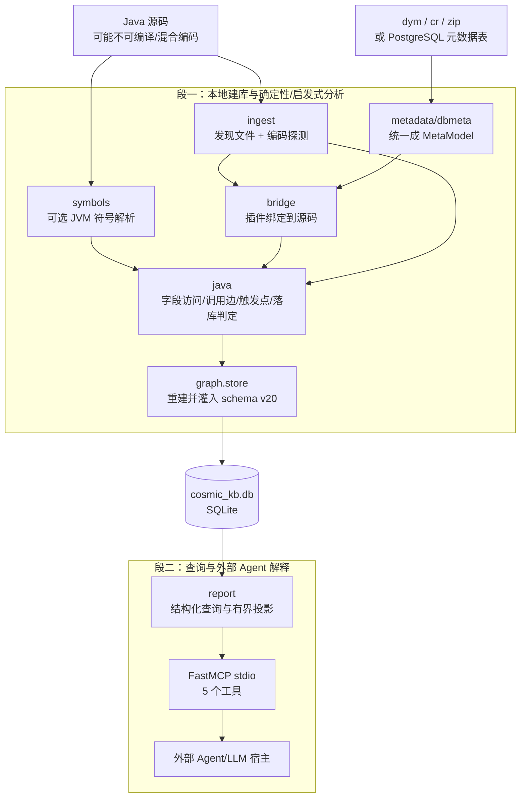

# cosmic_kb 项目精读：Java 后端从零学懂 AI 应用、源码实现与面试追问

> 适用读者：会 Java/后端开发，但做这个项目前没有做过 AI 应用，也不熟 Python。
> 当前代码基线：`cosmic_kb 0.2.1`、KB schema `v20`（2026-07-21 源码核对）。
> 文档目标：不只会背“静态分析 + RAG + MCP”，而是能顺着真实代码说明每一层做了什么、为什么这样选、有什么边界。

---

## 0. 先说明这份文档的可信口径

本文只把三类内容写成“项目已经实现”：

1. 能在当前源码中找到入口、数据结构和处理逻辑；
2. 能在当前 schema 或测试中找到对应契约；
3. 能由当前命令实际观察到，例如版本、资产自检和工具注册。

下面三件事要从一开始就说准确：

- **仓库本身没有调用 OpenAI、Claude 或其它模型 API。** 它负责本地建库、确定性/启发式取证，并通过 MCP 把 5 个工具暴露给外部 Agent。自然语言答案由 Claude Code、Codex、CodeBuddy、Qoder、Trae 等宿主里的模型生成。
- **项目不是“向量数据库问答”。** 主查询依赖 SQLite 结构化表和索引；FTS5 主要承接通用搜索。没有 embedding、向量库、reranker，也没有模型微调。
- **“有证据”不等于“绝不会幻觉”。** 工具层会返回行号、来源、置信度和 unknown，但外部模型仍可能误读或漏翻页。项目通过 MCP instructions、结构化状态和分页门降低风险，不能从数学上保证模型永不出错。

面试时宁可这样讲清边界，也不要把项目包装成一个并不存在的“自研大模型平台”。

### 建议阅读法

- 第一遍：读第一、二、三部分，先建立“业务问题 → 平台约束 → 项目架构”的因果链。
- 第二遍：精读第四、五部分，真正理解 Python 工程、建库和静态分析。
- 第三遍：精读第六～八部分，补 AI、MCP、可信度和工程化。
- 面试前：复习第九、十部分，并自己完成源码练习。

### 文档结构

1. 先把项目讲成人话；
2. 集中讲清苍穹平台现状，以及每项现状怎样推导出项目设计；
3. 架构和两条真实调用链；
4. Python 工程骨架；
5. 建库、元数据、桥接和 Java 静态分析；
6. 查询、MCP、RAG 与上下文治理；
7. Web、安装、分发和安全；
8. 测试、能力边界和技术债；
9. 面试追问与不同时间长度的讲法；
10. 七天源码精读路线、动手练习和最终自检。

---

# 第一部分：先把项目讲成人话

## 1. 项目解决的不是“写代码”，而是“理解历史代码”

典型场景是：接手一个没有完整文档的金蝶云苍穹老项目。现在某个字段值异常，开发者要回答：

- 这个字段真实中文名和所属分录是什么？
- 哪些插件、哪些事件、哪些 service 方法读写了它？
- 写完只是改了页面内存，还是会随事务落库？
- 某个审核操作除了人工点击，还有没有代码调用 `executeOperate` 触发？
- 某个方法谁在调用？最上游能否回到一个已注册且启用的插件事件？

传统做法是全局搜索字段字符串、来回查设计器、顺着调用链手工跳转。实际信息分散在平台元数据、Java 插件和运行期语义三处；第二部分会集中解释为什么只看其中任何一处都不够。落到排障结果上，问题表现为：

- 字段访问可能经过常量、形参或多层方法调用，普通文本搜索不完整；
- 配置关系和代码行为不在同一个视图里，人工需要反复拼接；
- 入口、调用和持久化结论依赖上下文，单看一行代码容易误判；
- 同名类、同名方法和方法引用会让纯文本搜索误报或漏报；
- “找不到”可能是确实不存在，也可能是分析器没覆盖到。

`cosmic_kb` 的做法是：先离线扫描源码和元数据，把可验证事实写进本地 SQLite KB；查询时由 CLI、Web 或 MCP 工具按字段/单据/操作/方法坐标读取证据。

### 30 秒项目介绍

> 苍穹用元数据定义业务实体和插件注册，Java 插件再介入生命周期并调用 service/helper，所以只看设计器或只搜源码都无法还原完整行为。cosmic_kb 会离线解析两边的信息，用 tree-sitter 和可选的 JavaParser Symbol Solver 建立字段读写、调用边和操作触发关系，统一写入本地 SQLite；外部 Agent 再通过 5 个 MCP 工具取得带类、方法、事件、行号和置信度的证据。它的重点不是生成新代码，而是把老系统的隐含关系变成可追溯证据。

### 项目不是什么

- 不是通用 Java 编译器或完整静态分析框架；
- 不是源码托管/在线 SaaS；
- 不是模型训练、微调或 Agent 框架；
- 不是向量检索系统；
- 不是能证明所有运行时行为的形式化验证器；
- 不是苍穹设计器的完全替代品。

这组非目标很重要，因为后面的技术选择都围绕“历史项目本地取证”而不是“做一个万能平台”。

---

## 2. 用 Java 后端的心智模型理解它

| 项目概念 | Java 后端类比 | 本项目里的实际含义 |
|---|---|---|
| Python 包 | Maven module/package | `cosmic_kb/` 下按职责分包 |
| `dataclass` | Lombok `@Data` + 构造器 | `SourceFile`、`MetaModel`、`FieldAccessRow` 等数据载体 |
| type hint | Java 泛型/接口提示 | 帮助阅读和检查，不是 JVM 那样的运行期强约束 |
| `Path` | `java.nio.file.Path` | 所有本地路径发现、规范化和安全校验 |
| 生成器 `yield` | Stream/Iterator | 扫大目录时逐个产出文件，避免一次性占满内存 |
| SQLite | 嵌入式 H2 | 一个文件就是 KB，不需要单独部署数据库服务 |
| tree-sitter AST | 宽容版 JavaParser/ANTLR AST | 源码不完整也尽量产出语法树 |
| Symbol Solver | IDE 的类型/方法解析 | 把 `service.foo()` 尽量绑定到唯一声明类和签名 |
| MCP tool | 给模型用的 Controller/API | 宿主模型看见工具 schema 后选择调用 |
| MCP instructions | 面向模型的接口使用规范 | 告诉模型什么时候用哪个工具、何时必须翻页 |
| RAG | 先查数据库再组织响应 | 外部模型先调本地工具取证，再生成中文解释 |
| confidence | 规则证据等级 | 工程规则赋值，不是统计学概率 |

### Python 代码阅读只需要先会这几件事

```python
@dataclass
class SourceFile:
    relpath: str
    text: str | None
```

可类比成：

```java
@Data
public class SourceFile {
    private String relpath;
    @Nullable private String text;
}
```

再记住几个差异：

- `None` 类似 `null`；`str | None` 类似 `@Nullable String`。
- `dict[str, Any]` 类似 `Map<String, Object>`。
- `with connection:` 类似资源/事务作用域，但具体事务语义仍要看库 API。
- `try/finally`、延迟 import、上下文管理器与 Java 的资源管理思想相同。
- Python 的“私有” `_name` 只是约定，不像 Java `private` 有强制访问控制。
- Python 可以在运行时给对象挂属性，所以要留意 `pg.annmap = ...` 这类动态写法。

读这个项目时，不要把精力耗在背 Python 语法；先跟住“输入对象 → 中间对象 → 数据库表 → 查询返回”。

---

# 第二部分：苍穹平台现状如何决定项目设计

这一部分只回答一个问题：**为什么项目必须同时解析元数据、理解 Java 插件、建立调用关系，还要补一层苍穹领域语义？**

不要把后续模块理解成作者随意堆出来的功能。它们分别是在补平台不同视图之间的断层。本章先把平台前提一次讲完；后续章节用 `CQ-1`～`CQ-8` 引用这些前提，不再到处重复苍穹知识。

## 本章总纲：元数据定义“是什么”，插件代码干预“何时、怎样做”

苍穹不是典型的“Java 实体类 + Spring Service + Controller”系统。更接近下面这套模型：

```text
元数据 XML
  定义：表单、实体、字段、分录、操作、插件注册关系
             │
             ▼
苍穹运行时
  负责：装载模型、创建 DynamicObject、调度操作和生命周期事件
             │
             ▼
Java 插件
  干预：某个事件发生时读写数据、校验、转换、反写或调用其它操作
```

因此，**Java 代码不是业务实体定义的唯一来源，很多时候甚至不是实体定义的来源；它主要是挂在平台生命周期上的扩展逻辑。** 只读 Java，看不到字段真实中文名、实体层级、插件绑定和启用状态；只读元数据，又看不到插件内部调用了哪些 service、改了哪些字段、是否显式保存、是否程序化触发其它操作。

`cosmic_kb` 的核心不是“把 Java 文件做全文搜索”，而是把以下三类证据对齐：

1. **元数据事实**：系统中定义了什么、谁注册到哪里；
2. **源码行为**：插件和 service 实际读写、调用了什么；
3. **领域语义**：某类插件、某个事件、某个 SDK 调用在苍穹生命周期中意味着什么。

## CQ-1：业务实体由元数据描述，不由 Java POJO 完整表达

苍穹的表单、实体、表头、分录、子分录、字段类型、数据库列、下拉选项、基础资料引用等，主要保存在 dym 或底层库中的 XML 元数据。Java 项目里通常没有一组与这些业务实体一一对应、字段固定的 POJO 可以直接反射。

这会带来三个直接后果：

- 在源码里看到 `cqkd_amount`，不能只凭命名猜它的中文名、类型和所属单据；
- 同一个字段 key 可能出现在不同单据或不同层级，裸 key 不是全局唯一业务坐标；
- 分录层级、数据库列和基础资料引用，不能从一次 `get/set` 调用本身推出。

所以本项目的设计是：

- 把 dym、cr、导出包和数据库 XML 都解析成统一 `MetaModel`；
- 把 `form_key + entity_key + level + field_key` 当作业务坐标，而不是只存字段字符串；
- `resolve_fields` 只返回元数据中查到的名称、枚举和引用，歧义时返回候选，不按拼音猜。

## CQ-2：业务 Java 的平台入口以生命周期插件为主，不是 Controller

平台先根据元数据装载表单和操作，再在特定生命周期节点回调已注册插件。常见扩展面包括表单、单据、列表、操作、转换、反写、任务、开放接口和工作流等；不同插件基类、注册位置和事件方法代表不同执行语境。

这与 Spring MVC 最大的差异是：项目源码里通常找不到一行普通 Java 调用去执行 `afterCreateNewData()`、`beforeDoOperation()` 之类的入口方法。调用方在苍穹运行时内部，**元数据注册关系才是“平台会不会调这个类”的关键证据。**

这里要把口径说准：不是每个 Java 类都是插件。项目里仍然会有 service、helper、util 等普通类；只是它们通常由插件入口继续调用，本身不会因为存在于源码目录就被平台自动执行。插件是平台世界与普通 Java 调用链之间的适配边界。

所以本项目的设计是：

- 从元数据提取插件 FQN、插件类型、绑定单据/操作和启用状态；
- 用 FQN 把注册记录桥接到真实 Java 类；
- 把插件事件当调用图入口，向下追到 service/helper；
- 反查方法调用方时，向上追到插件边界后再检查注册状态，而不是把“项目内没有 caller”直接判成死代码。

## CQ-3：运行期数据是 `DynamicObject`，字段和实体大量使用字符串 key

苍穹常用 `DynamicObject`、`DynamicObjectCollection` 和页面 `Model` 承载数据。字段访问表现为 `obj.get("key")`、`obj.set("key", value)`、`model.setValue(...)`，分录行又来自集合、事件参数、加载接口、转换数据包或跨方法形参。

因此，识别出 `.set()` 只完成了最简单的一步。真正困难的是回答：接收者变量代表哪张单、哪个实体层级，它的字段 key 是字面量、常量还是运行时表达式。

所以本项目没有做通用“Java 赋值语句扫描”，而是：

- 专门识别 Model API、`DynamicObject` 和集合访问习语；
- 建立模型变量、数据包变量和集合变量三类上下文；
- 传播常量、实参到形参、返回值、for-each 行变量和跨类调用来源；
- 无法收敛时保留 `form_key_source`、`null_reason` 和动态 key 原因，不伪造归属。

## CQ-4：设计器看到注册关系，源码看到调用关系，两边都不完整

元数据能说明“某单据绑定了哪些插件和操作”，但不能说明插件内部又调用了哪个 service，或者是否通过 `executeOperate`/`invokeOperation` 程序化触发了别的操作。反过来，源码能看到调用语句，却未必知道调用类绑定在哪张单、目标操作是否属于元数据中的哪个业务对象。

所以本项目必须做“双源桥接”：

- 元数据侧建立 form/entity/field/operation/plugin/binding；
- 源码侧建立 class/method/field_access/call_edge/op_trigger；
- 通过插件 FQN、业务坐标和调用边把两侧连接；
- 建库只保存可审计的单跳事实，查询时再按需拼多跳链，避免把未知值和环路固化进库。

## CQ-5：元数据不是一种整齐、完整、单一来源的 XML

同一业务模型可能来自单个 dym、转换规则 cr、平台双层导出包，或者底层库中分开的 form/entity XML。业务 dym 还可能只保存对模板的覆盖，完全继承的预制操作并不显式重复；原厂模型与 ISV 扩展、自家 ISV 的最新版元数据，合并语义也不同。

所以本项目在边界处建立 Anti-Corruption Layer：

- `package_loader` 隔离双层包和 manifest 结构；
- `dym_parser`/`dbmeta` 把不同来源统一成 `MetaModel`；
- `TemplateRegistry` 补齐继承但未显式写出的预制操作；
- 原厂母体与本地扩展做结构合并，自家 ISV 最新完整模型则同 key 整条替换；
- 每个模型保留来源，合并冲突和未知项不能静默消失。

## CQ-6：历史项目源码经常不满足“干净可编译工程”的假设

老项目可能多模块、混合 UTF-8/GB18030 编码，依赖本机私有 jar、IDEA 配置或厂商 Gradle 模板；还可能缺模块、缺依赖，无法在分析机上直接完整编译。如果把“先编译成功”当建库前提，最需要排障的项目反而最先被拒之门外。

所以本项目的设计是：

- 摄取层单独处理编码、坏文件、跳过目录和稳定路径；
- tree-sitter 作为宽容语法底座，即使工程不完整也尽量产出 AST；
- JavaParser Symbol Solver 作为可选精度层，有 classpath 时消歧声明类和签名；
- 只读依赖声明和本地 jar，不执行用户项目的 Gradle/Maven 构建；
- 符号层失败时软降级，并把失败率和解析来源写入结果。

## CQ-7：平台动态派发使“静态找不到调用”不等于“不会执行”

插件入口由平台注册表、任务配置、工作流或开放平台运行时派发，项目内未必存在静态调用边。反射、脚本、动态代理和字符串派发也可能绕开普通 AST 调用。因此，静态分析特别容易把“我没看见”误说成“不存在”。

所以本项目把负向结论设计得比正向结论更谨慎：

- `call_edge` 连解析失败的调用点也保存；
- `callers` 同时返回符号覆盖率、失败文件和搜索是否截断；
- 插件入口结合注册/启用状态给 `entry_reachable`、`entries_inactive`、`entry_unverifiable`、`no_entry_found`、`not_analyzed`；
- 对无法覆盖的动态机制返回 `unknown`，不把 0 条静态边包装成运行时证明。

## CQ-8：改了数据对象不等于数据一定落库

同样一行 `setValue()`/`DynamicObject.set()`，发生在页面内存事件、操作事务、转换数据包构建或普通 helper 中，业务含义完全不同。它可能只是改当前页面内存，也可能随操作事务保存，可能随目标单保存，还可能通过显式 save/DB 调用立即持久化。

所以“是否落库”不能只靠发现写字段来判断。本项目组合三类证据：

1. 插件类型和事件方法映射出的生命周期相位；
2. 元数据中绑定操作的类型；
3. 入口可达路径上的显式 save、`executeOperate`、DB 等 sink。

结论只能是规则驱动的 `yes/no/unknown` 和证据说明，不是对所有运行时分支、事务回滚、数据库触发器的形式化证明。

## 从平台约束到项目模块：一张表记住全部设计方向

| 平台现状 | 造成的排障断层 | 本项目设计 | 主要代码 |
|---|---|---|---|
| `CQ-1` 元数据定义实体 | Java 里查不到完整业务坐标 | `MetaModel`、坐标化字段、`resolve_fields` | `metadata/`、`report/resolve_fields.py` |
| `CQ-2` 插件由生命周期回调 | 普通调用图没有真实入口 | 插件桥接、事件入口、注册状态 | `bridge/`、`java/event_extractor.py` |
| `CQ-3` 动态数据包 + 字符串 key | `.set()` 无法直接归属单据/分录 | 领域习语 + 上下文/参数/返回值传播 | `java/field_access.py`、`java/analyze.py` |
| `CQ-4` 配置关系与代码关系割裂 | 单看设计器或源码都缺边 | 元数据图 + Java 图 + 单跳关系 | `graph/`、`java/call_edges.py`、`java/op_trigger.py` |
| `CQ-5` 来源异构且存在继承/扩展 | 导出物不等于完整模型 | 统一模型、模板回填、差异化合并 | `metadata/package_loader.py`、`dbmeta/` |
| `CQ-6` 老工程不一定可编译 | 编译器方案可用性差 | tree-sitter 保底 + Symbol Solver 增强 | `ingest/`、`java/ast.py`、`symbols/` |
| `CQ-7` 运行时动态派发 | 0 调用方容易误判死代码 | 覆盖率、失败边、入口 verdict、unknown | `java/call_edges.py`、`report/callers.py` |
| `CQ-8` 内存写不等于落库 | 只看字段写入会误判 | 事件相位 + 操作类型 + sink 矩阵 | `java/plugin_classifier.py`、`java/persistence.py` |

面试时可以用这一句收束：

> 苍穹用 XML 元数据定义业务对象和插件注册，用运行时调度生命周期；业务 Java 的平台入口主要以插件形式挂在这些节点上，再由插件调用 service/helper 完成具体行为。所以我的工具不能只做源码搜索，而要把元数据事实、插件入口、动态数据包流、Java 调用边和领域生命周期统一进一个可审计 KB。

---

# 第三部分：架构和两条主调用链

## 3. 两段式架构：KB 是契约



这里的“确定性”要说得有分寸：

- 文件读取、XML 解析、SQL 查询、精确 FQN 命中是确定性的；
- 字段来源传播、名字兜底、事件相位和落库结论中包含领域规则与启发式；
- 项目通过 `confidence`、`resolution`、`null_reason` 和 `unknown` 把强弱证据显式化；
- 最终自然语言解释仍是概率性模型输出。

所以更严谨的说法是：**段一产出可重复、可审计的结构化分析结果，其中每条推断标明证据等级；段二不重新发明事实，只查询并解释这些结果。**

### 为什么要拆两段

1. **可测试**：静态分析和 SQL 查询不需要启动模型即可单测。
2. **可复用**：CLI、Web、MCP 共用同一个 KB 和 report 逻辑。
3. **可审计**：类、方法、文件、行号、解析来源都能回到源码。
4. **可降级**：没有 Java 或 classpath 时，仍能用 tree-sitter 和名字规则建库。
5. **避免每次全量读源码**：重计算在建库阶段做，查询阶段按坐标取证。

如果面试官说“这不就是 ETL + 查询服务吗”，可以回答：模式本身确实不新；工程价值在于把苍穹元数据和 Java 行为统一到可审计契约里，并把不确定性显式带到模型侧，而不是用大模型直接猜老系统。

---

## 4. 两条必须背熟的真实调用链

### 4.1 建库链路

命令入口来自 [`pyproject.toml`](../pyproject.toml)：

```toml
[project.scripts]
cosmic_kb = "cosmic_kb.cli.main:main"
cosmic_kb-mcp = "cosmic_kb.mcp.server:main"
```

`cosmic_kb build ...` 的主链是：

```text
cli.main.main
  -> build_parser 解析命令
  -> _cmd_build
  -> _build_kb
       -> ingest.scanner.scan
       -> metadata/package/dbmeta 收集 MetaModel
       -> symbols.classpath.discover_classpath（可选）
       -> symbols.runner.run（可选）
       -> bridge.namespace.build_index
       -> bridge.linker.link
       -> report.project_map.module_map
       -> graph.store.build_kb
            -> _populate 元数据/桥接/图谱
            -> java.analyze.analyze
            -> _populate_java / constants / triggers / call_edges / coarse
            -> _write_meta
```

关键入口分别在：

- [`cosmic_kb/cli/main.py`](../cosmic_kb/cli/main.py)
- [`cosmic_kb/ingest/scanner.py`](../cosmic_kb/ingest/scanner.py)
- [`cosmic_kb/metadata/dym_parser.py`](../cosmic_kb/metadata/dym_parser.py)
- [`cosmic_kb/java/analyze.py`](../cosmic_kb/java/analyze.py)
- [`cosmic_kb/graph/store.py`](../cosmic_kb/graph/store.py)

### 4.2 一次 Agent 查询链路

以“`cqkd_ht.cqkd_amount` 谁写了，是否落库”为例：

```text
用户自然语言
  -> 外部宿主模型读取 MCP 工具说明
  -> 选择 trace(field="cqkd_ht.cqkd_amount", kind="field")
  -> FastMCP 调 tool_trace
  -> 每次新开 SQLite connection
  -> field_trace.parse_locator
  -> field_trace.trace_compact
       -> SQL 查询 field / field_access / plugin / binding / call_edge ...
       -> 按坐标分组、汇总、分页、控制字节预算
  -> 返回 JSON 证据
  -> 外部模型组织中文答案
```

注意：

- 模型没有直接执行 Python 函数；MCP 宿主负责收发调用。
- `tool_trace` 不是严格数学意义上的纯函数，因为它读取环境变量并访问 SQLite；更准确地说，它是**不依赖 MCP SDK 的协议无关业务函数**。
- MCP 层没有复制 report 查询逻辑，只做参数转换、连接生命周期和工具注册。

---

# 第四部分：项目骨架和 Python 工程化

## 5. 包结构：每个目录负责什么

| 目录 | 责任 | 关键产物/入口 |
|---|---|---|
| `ingest/` | 扫源码、探编码、排除产物 | `ScanResult` |
| `metadata/` | dym/cr/zip → 统一模型 | `MetaModel` |
| `dbmeta/` | 只读直连平台库补元数据 | `DbMetaReader`、同步/合并结果 |
| `bridge/` | 元数据插件类 ↔ 源码类 | `BridgeResult` |
| `java/` | AST、字段读写、调用链、落库规则 | `AnalysisResult` |
| `java/symbols/` | classpath + JVM 符号解析 | `SymbolTable` |
| `graph/` | schema 与 SQLite 灌库 | `cosmic_kb.db` |
| `report/` | 取证查询、汇总、分页 | trace/bill/callers 等 dict |
| `semantic/` | 标识词典辅助 | `FieldLexicon` 等 |
| `semantics/` | 苍穹领域 Markdown 资产 | `cosmic_semantics` 内容 |
| `mcp/` | FastMCP 薄适配 | 5 个 MCP tools |
| `web/` | 仅本机的只读展示层 | `/api/*` + 静态前端 |
| `skills/` | 两份 Agent 工作流 Skill 与安装器 | setup/understand Skill |
| `bootstrap/` | plan/apply/status 安装编排 | 安装清单、建库、注册、验证 |
| `cli/` | 全部命令行参数和子命令 | `main()` |
| `_assets.py` | 随 wheel 资产定位与 doctor | `importlib.resources` |

### 需要警惕的文档漂移

个别 `__init__.py` 仍保留早期阶段描述，例如 `semantic` 里还提到已退役的 NL 意图解析，`mcp/__init__.py` 文字里写“四个工具”但当前实际是五个。判断当前行为时，优先级应是：

```text
可执行源码/测试 > schema/当前 README > 阶段性注释和早期设计文档
```

面试时可以把这说成真实工程经验：长期项目的注释可能漂移，所以关键契约必须由测试和运行结果守住。

---

## 6. 依赖为什么拆成 optional extras

[`pyproject.toml`](../pyproject.toml) 的运行期硬依赖是空列表：

```toml
dependencies = []
```

可选能力分组：

- `parse`：`tree-sitter`、`tree-sitter-java`
- `encoding`：`charset-normalizer`
- `mcp`：MCP SDK
- `postgres`：`psycopg2-binary`
- `dev`：pytest
- `complete`：把前四组一次装齐

### 为什么这样选

- `cosmic_kb --version`、基础 CLI 和资产检查不应因没装 PostgreSQL/MCP 而启动失败；
- 用户可能只离线解析 dym，不需要数据库驱动；
- 用户可能只跑 CLI，不需要 MCP；
- 延迟 import 让缺少可选依赖时能返回明确降级信息。

### 代价

- 运行到某个功能才发现 extra 未安装；
- 测试矩阵更复杂；
- `complete` 的依赖声明要和各分组保持同步。

这相当于 Java 中把重量能力拆成可选 starter，而不是把所有驱动和 SDK 塞进一个 fat 应用。

---

# 第五部分：段一建库实现

本部分只解释代码怎样兑现第二部分的约束：摄取对应 `CQ-6`，元数据统一对应 `CQ-1/CQ-5`，桥接对应 `CQ-2/CQ-4`，字段和调用分析对应 `CQ-3/CQ-7/CQ-8`。平台背景不再逐节重讲。

## 7. 摄取层：怎样把“野生 Java”稳定读进来

核心文件：[`cosmic_kb/ingest/scanner.py`](../cosmic_kb/ingest/scanner.py)

### 7.1 数据结构

`SourceFile` 保存：

- 绝对路径与相对路径；
- 字节数；
- 最终编码和编码置信度；
- 解码后的文本；
- 失败原因。

`ScanResult` 保存全部文件、跳过目录、跳过的符号链接，并提供 `ok_files`、`failed_files`。

相对路径统一成 POSIX 风格，是为了让 Windows/Linux 结果、数据库证据和符号表 key 更稳定。

### 7.2 编码探测顺序

`detect_encoding(raw)` 的真实策略：

1. BOM 命中时直接判 UTF-8-sig/UTF-16，置信度 1.0；
2. 严格 UTF-8 解码成功则判 UTF-8；
3. 可选使用 `charset-normalizer`；
4. 针对大陆中文老项目，对 CJK 误判做 `gb18030` 偏置；
5. 最后回退 `gb18030`，置信度 0.3；
6. 若严格解码仍失败，用 replacement 保住可分析文本，并把置信度降为 0.2。

### 为什么不是统一 `errors="ignore"`

`ignore` 会静默丢字符，可能把字段 key、字符串常量或语法标记删掉，后续行号和分析结果都不可信。当前实现选择“尽量严格 + 最后 replacement + 显式低置信”。

### 7.3 目录扫描

`scan()` 使用 `os.walk(topdown=True)`，在遍历时原地裁剪：

- `target/build/out/.git/.idea/node_modules` 等目录；
- 非 `.java` 文件；
- 默认不跟随符号链接，避免环和越界；
- 最终按 `relpath` 排序，保证结果稳定。

`iter_source_files()` 是惰性版本；`scan()` 为了后续多轮分析会把结果物化进内存。

### 边界

- 超大仓库仍会把所有源码文本放在 `ScanResult.files`，不是完全流式管线；
- 编码置信度是工程估计，不是统计保证；
- replacement 后的 AST 可能局部失真，因此覆盖率报告必须保留读取状态。

---

## 8. 元数据层：把 dym、压缩包和数据库统一成 `MetaModel`

本节是 `CQ-1/CQ-5` 的实现展开：重点看输入怎样归一、模型怎样合并，不再重复“为什么实体定义必须来自元数据”。

核心文件：

- [`cosmic_kb/metadata/model.py`](../cosmic_kb/metadata/model.py)
- [`cosmic_kb/metadata/dym_parser.py`](../cosmic_kb/metadata/dym_parser.py)
- [`cosmic_kb/metadata/package_loader.py`](../cosmic_kb/metadata/package_loader.py)
- [`cosmic_kb/dbmeta/`](../cosmic_kb/dbmeta/)

### 8.1 为什么先建统一模型

上游来源很多：单个 dym、转换规则 cr、双层 zip、数据库里的 form/entity 两段 XML。下游桥接、分析和存储不应该理解每种来源，所以统一成：

```text
MetaModel
  ├─ MetaEntity[]
  ├─ MetaField[]
  ├─ MetaOperation[]
  ├─ MetaPlugin[]
  └─ ConvertInfo?
```

这是典型的 Anti-Corruption Layer：把外部复杂格式挡在边界外，下游只认领域模型。

### 8.2 实体和字段怎么解析

`parse_element()`：

1. 如果存在 `DesignConvertRuleMeta`，转到转换规则分支；
2. 分别取得 `DesignFormMeta` 和 `DesignEntityMeta`；
3. 根据 `ModelType` 归一成 bill/basedata/dynamic/report 等；
4. 从数据模型的 `Items` 中识别表头、分录、子分录；
5. 用实体 `Id -> entity` 映射，根据字段 `ParentId` 回填层级和所属实体；
6. 解析字段 key、中文名、数据库列、类型、下拉选项、基础资料引用；
7. 解析布局插件和操作插件。

字段分类不是简单看标签：

- `BasedataPropField` → `basedata_prop`
- 指向继承根或覆盖型无 key → `inherited`
- 有 `FieldName` → `entity`
- 动态表单无 DB 列 → `dynamic`
- 其余无 DB 列 → `platform`

### 8.3 为什么操作要用模板回填

对应 `CQ-5` 的模板继承问题，`TemplateRegistry` 用随包的 `bos_billtpl.dym`、`bos_basetpl.dym` 补齐输入里未显式展开的预制操作：

- 业务操作有自己的 key 时，以业务节点为准；
- 只有 `oid` 时按模板回填 key/name/type；
- 模板没命中时保留 oid，语义写 unknown；
- 最后补齐业务 XML 没显式出现的预制操作。

如果不做这一步，`bill` 的操作集会结构性缺失，落库判定也拿不到操作类型。

### 8.4 双层 zip 为什么单独处理

对应 `CQ-5` 的异构输入，`package_loader.py` 根据外层 manifest 定位内层包，再从 `metadata/` 中读取 dym/cr，同时记录来源；下游始终只得到 `MetaModel`，不感知包结构。

### 8.5 数据库元数据源的只读防线

`dbmeta` 当前实现 PostgreSQL，配置可用 `COSMIC_DB_PASSWORD` 覆盖明文密码。

[`connection.py`](../cosmic_kb/dbmeta/connection.py) 有三类保护：

1. SQL 必须以 SELECT/WITH 开头，拒绝写/DDL 关键字和多语句；
2. psycopg2 会话设置 `readonly=True, autocommit=True`；
3. 上层只暴露 `query()`，没有写接口。

需要诚实说明：SQL 关键字白名单不是通用 SQL 安全解析器，真正的强约束是数据库账号权限和 PostgreSQL 会话只读；生产上仍应该使用数据库侧只读账号。

### 8.6 原厂补全与自家 ISV 同步为什么是两种合并语义

这是很容易被追问的设计点：

- `dbmeta/integrate.py` 处理**原厂母体 + 本地扩展**，要保留双方字段并合并结构，同时去掉原厂插件，避免把平台/别项目插件归到当前项目。
- `dbmeta/sync.py` 处理**本项目自己 ISV 的最新完整元数据**，同 key 必须整条替换，不能把已删除旧字段继续并集留下。

此外，当前 build 每次重建整个 KB，所以自家 ISV 同步也必须拉当前完整集合；如果只拉“本次变化”，未变化模型会从新 KB 消失。这是“源端增量”和“目标端全量重建”不能混用的典型后端问题。

---

## 9. 桥接层：把元数据里的插件类绑到真实源码

核心文件：

- [`cosmic_kb/bridge/namespace.py`](../cosmic_kb/bridge/namespace.py)
- [`cosmic_kb/bridge/linker.py`](../cosmic_kb/bridge/linker.py)

### 9.1 源码索引

`namespace.build_index()` 为每个源码单元提取：

- package；
- 顶层 class/interface/enum/record；
- FQN；
- extends/implements；
- 相对路径。

优先使用 tree-sitter，必要时保留正则/文本兜底。还会计算插件基类传递闭包，识别“没有元数据绑定但继承苍穹插件基类”的类。

### 9.2 为什么唯一主键是全限定类名

这是 `CQ-2/CQ-4` 的连接键选择：元数据 `<ClassName>` 保存 FQN，而 ISV 前缀、包名前几段、文件名都可能不一致。当前匹配优先级：

1. FQN 精确命中：`linked`，confidence 1.0；
2. FQN 失败但简单类名唯一：`linked_by_name`，confidence 0.6；
3. 简单类名多处：`ambiguous`；
4. 项目插件无源码：`missing`；
5. `kd.*`、无 ClassName、明显非 Java 类引用：`external`。

不要只说“三态桥接”；当前实现实际上有五种 status。

### 9.3 孤儿类不是垃圾

源码存在但没被元数据绑定的类可能是：

- `plugin`：继承苍穹插件基类，可能是未注册/历史插件；
- `constant`：常量类，后续字段 key 解析要用；
- `unknown`：service/util/webapi 等普通项目类。

所以不能只分析已绑定插件。后面的 Java 分析有“绑定插件入口扫描 + 未绑定插件入口 + 全量孤立补全”三层。

### 9.4 项目模块怎么划分

`report/project_map.py` 用元数据 `appKey` 做主锚，已绑定源码类继承模块；包前缀只用来给孤儿类归属和交叉校验。原因是历史项目包结构可能按开发者或年代组织，不能把 `com.xxx.foo` 的某一级硬当业务模块。

---

## 10. Java 解析为什么是“双引擎”而不是二选一

### 10.1 tree-sitter：鲁棒性底座

[`cosmic_kb/java/parser.py`](../cosmic_kb/java/parser.py) 只负责解析状态：

- `ok`：AST 干净；
- `partial`：有 ERROR/MISSING，但树可用；
- `skipped`：没有文本；
- `unavailable`：可选依赖没装。

它用显式栈遍历 AST，记录错误片段和节点数，不让深树触发 Python 递归上限。

为什么选 tree-sitter：

- 不要求项目完整编译；
- 缺 jar、缺生成类或局部语法错误时仍能恢复；
- 适合做字段访问、方法声明、调用点这类局部模式识别。

缺点：它主要给语法结构，不天然知道 `x.save()` 的 `x` 到底是什么类型。

### 10.2 JavaParser Symbol Solver：精度增强层

核心文件：

- [`cosmic_kb/java/symbols/classpath.py`](../cosmic_kb/java/symbols/classpath.py)
- [`cosmic_kb/java/symbols/runner.py`](../cosmic_kb/java/symbols/runner.py)
- [`cosmic_kb/java/symbols/table.py`](../cosmic_kb/java/symbols/table.py)
- [`tools/symsolver/`](../tools/symsolver/)

为什么不用 Python 重写 Java 类型系统：Java 重载、继承、泛型、方法引用和 jar 声明解析很复杂，成熟 JavaParser Symbol Solver 更适合。Python 负责大流程，Java 微工具只负责它擅长的符号绑定。

### 10.3 classpath 发现，但绝不执行构建

支持三条路径，优先级是：

1. 用户显式 `--classpath-dir`；
2. IDEA `.idea/modules.xml`、`.iml`、library XML；
3. 金蝶 Gradle 模板的 properties/config/settings；
4. 全部失败则 `status=none`。

它只读配置并枚举本地 jar，不执行 Maven/Gradle/javac，也不联网下载依赖。每个适配器都会写 `attempts`，让“为什么没发现 classpath”可诊断。

### 10.4 JVM 微工具协议

Python 通过 stdin 发一份 JSON 请求，Java 通过 stdout 发 JSONL：

```text
start -> solver_ready -> file* -> summary
```

Java 端构造 `CombinedTypeSolver`：

```text
JDK ReflectionTypeSolver
  + 项目源码 JavaParserTypeSolver
  + 本地 jar JarTypeSolver
```

源码优先于 jar，避免旧编译产物遮蔽当前源码。

每个调用点有两层解析：

1. `expr`：直接 `.resolve()` 成功，confidence 1.0；
2. `scope`：先确定接收者类型，再按方法名和参数个数唯一匹配，confidence 0.95；
3. `failed`：保留失败原因，Python 侧再决定是否用 tree-sitter 名字启发式。

`SymbolTable` 用 `(relpath, line, methodName)` 做主索引；同行同名多个调用时用字符列 `col` 消歧。对不上就返回 None，不猜。

### 10.5 为什么 JSONL 而不是一次返回大 JSON

- 每完成一个文件就形成恢复边界；
- 微工具中途崩溃时，已收到文件仍可用，状态为 `partial`；
- 可以流式显示进度；
- 避免最后一个大响应才暴露失败。

### 10.6 看门狗和软降级

Python runner 用线程读取 stdout/stderr，因为 Windows 管道阻塞读本身不好做超时：

- solver 构建阶段默认允许 600 秒；
- 之后事件间静默 120 秒就终止；
- 找不到 Java/JAR → `unavailable`；
- 有部分 file 事件后失败 → `partial`；
- 一个文件都没产出 → `failed`。

无论哪种失败，主 build 都可以退回 tree-sitter/名字规则。这叫能力降级，不叫吞错：失败原因和覆盖率仍写入 KB meta。

### 面试追问：为什么不直接 javac

> javac 需要项目依赖和构建条件基本完整，而目标恰恰是缺依赖、可能不可编译的老项目。tree-sitter 保证“能看见局部结构”，Symbol Solver 在能发现本地 classpath 时提高类型绑定精度；两层叠加比单押任一方案更符合历史项目现状。

---

## 11. Java 静态分析主引擎：字段读写到底怎样找出来

核心入口：[`cosmic_kb/java/analyze.py`](../cosmic_kb/java/analyze.py)

### 11.1 全项目基础索引

`project_graph.build_project_graph()` 对每个顶层类型建立：

- FQN、简单名、源码路径；
- 全部方法声明和类内调用图；
- 成员字段类型；
- 项目级常量表；
- 简单类名到 FQN 候选；
- 可选 `SymbolTable`。

同名重载有一个重要设计：

- 按名字建调用边时，`methods` 只保留首个，属于保守简化；
- 做字段补扫时，`method_decls` 保留所有重载，避免某个重载方法体整片漏掉。

这说明项目不是完整重载解析器；符号层能提高调用边精度，但部分 tree-sitter 兜底仍按方法名工作。

### 11.2 常量解析

`constants.py` 收集全工程字符串常量，支持：

- 字符串字面量；
- 类内/限定常量引用；
- 唯一值解析；
- 同名不同值时标 `ambiguous`。

字段 key、分录 key、表单 key、操作 key 都经这层解析。解不出时不会拿常量名的英文含义猜中文业务名。

### 11.3 字段访问习语 A：模型 API

[`field_access.py`](../cosmic_kb/java/field_access.py) 识别：

```java
getModel().setValue("field", value);          // 表头写
getModel().setValue("field", value, row);     // 分录写
getModel().setValue("field", value, row, sub);// 子分录写
getModel().getValue(...);                      // 对应读取
```

层级按实参数量判断。模型接收者可以是 `getModel()`，也可以是跨方法传播进来的 `IDataModel/IBillModel/IFormView` 形参。

这正是 `CQ-3` 的实现选择：只识别稳定的领域访问习语，比把任意 Java 赋值都猜成业务字段访问误报更低。

### 11.4 字段访问习语 B：DynamicObject

```java
DynamicObject bill = e.getDataEntity();
DynamicObjectCollection rows = bill.getDynamicObjectCollection("entry");
for (DynamicObject row : rows) {
    row.set("amount", value);
}
```

难点不在识别 `.set()`，而在确定接收者 `row` 是哪张单、哪个分录。

`_build_contexts()` 建三类环境：

- 模型变量集合；
- 数据包变量 `doc_ctx`；
- 集合变量 `coll_ctx`。

来源规则包括：

- 插件事件入参 → 插件绑定单据；
- `BusinessDataServiceHelper.load/loadSingle` 等 → 实体实参；
- 转换插件目标数据包 → 目标单，`CONVERT_SOURCE` → 源单；
- `getDynamicObjectCollection(entryKey)` → 分录集合；
- for-each/lambda 行变量继承集合坐标；
- 基础资料 `getDynamicObject(key)` → basedata；
- 方法返回值可通过 `_RetResolver` 传播回调用方局部变量。

它做定点迭代，直到依赖链上的变量上下文不再变化。这是“轻量数据流分析”，不是完整 SSA/points-to。

### 11.5 跨方法/跨类来源传播

从调用点按实参位置传播到形参：

- `DynamicObject`/集合形参：传播 `(level, entry_key, entity, is_collection)`；
- model/view 形参：传播绑定单据；
- `String` 形参：传播字段/分录 key 字面值。

`_walk_event()` 从插件事件入口做有界 BFS，默认最大深度 8。跨类边优先 SymbolTable，失败后才用局部变量类型、成员类型、静态类名等启发式。

每条字段访问同时记录：

- `plugin_fqn`：从哪个入口插件触发；
- `access_class/access_method`：读写物理发生在哪里；
- `event_method/event_phase`：入口事件；
- `path`：入口到实际方法的路径；
- `edge_source`：local/symbol/heuristic/mixed。

这解决了“字段是在 service 里写的，但业务上是某个插件事件触发”的归因问题。

### 11.6 三轮覆盖

`analyze()` 不是只扫绑定插件：

1. **绑定插件归因**：从已知事件入口跨类扫描；
2. **未绑定插件入口**：对 task/webapi/workflow 等插件基类，用事件名和调用图根方法做入口；
3. **孤立补全**：其余 service/util 的所有方法逐个抽取字段访问。

随后还做两类回填：

- 反向调用图固定点传播：多个调用点只有全部都推出相同来源时才采纳；
- 元数据反查：字段只属于一个 form、与绑定单据交集唯一、或同一接收对象多个字段候选交集唯一时回填。

回填会写 `form_key_source`，明确它来自真实数据流还是 metadata_unique/binding/cooccur，不把弱证据伪装成强证据。

### 11.7 动态 key 和未定位原因

字段 key 可能是：

- 循环变量：`dynamic-loop`
- 字符串拼接：`concat`
- 外部常量：`external-const`
- 同名常量歧义：`ambiguous`
- 其它表达式：`dynamic/unknown`

来源单据为空时，`null_reason.py` 进一步给有限原因码，例如：

- `field-key-undeterminable`
- `basedata-ref`
- `basedata-write-suspect`
- `dynamic-entity`
- `helper-caller-unknown`
- `model-context`
- `local-or-container-source`

这种“为什么是 null”的建模比单纯返回 null 更适合排障，也方便 coverage/report 分桶。

---

## 12. 事件、落库、调用边和操作触发点

### 12.1 插件类型与事件相位

对应 `CQ-2/CQ-8`，`plugin_classifier.py` 优先使用元数据注册类型，父类只是佐证/兜底；`event_extractor.py` 再把已知事件映射到：

- `memory`：表单页面内存阶段；
- `transaction`：操作/反写事务阶段；
- `build`：下推/数据包构建；
- `validate`：校验；
- `none`：没有落库语义；
- 普通方法标 `helper`。

相位来自领域知识表，不是 Java 语法本身；AST 提供调用事实，领域表补上生命周期语义。

### 12.2 显式落库 sink

[`persistence.py`](../cosmic_kb/java/persistence.py) 识别：

- `SaveServiceHelper.save/update/saveOperate`
- `OperationServiceHelper.executeOperate`
- `BusinessDataServiceHelper.save`
- `DeleteServiceHelper.delete`
- `DB.execute/update/...`
- 部分 `invokeOperation("save/audit/...")`

有符号结果时用声明类 FQN 白名单确认，避免项目自定义同名 helper 被误判；无符号时才按接收者文本兜底。

### 12.3 落库判定矩阵

优先级大致是：

1. 入口可达路径出现显式 sink → `yes`；
2. transaction + save/submit/audit 等入库操作 → `yes`；
3. transaction + donothing 且无 sink → `no`；
4. build → 条件落库，当前编码为 `yes` 但 confidence 0.6，理由写“随目标保存”；
5. memory/validate/none 且无 sink → `no`；
6. 有无法解析的外部调用时，部分 `no` 会降为 `unknown`。

注意：这是领域规则驱动的静态判定，不是运行时事务证明。它不理解所有自定义持久化封装、反射、数据库触发器和工作流副作用。

### 12.4 为什么 `call_edge` 保存失败站点

`call_edges.py` 保存每个调用点：

- 普通 invocation 和 `Class::method` 方法引用；
- 项目、jar、JDK 目标；
- expr/scope/heuristic/failed；
- 文件、行、列、签名、confidence、evidence。

即使 `target_fqn=NULL` 也落库。原因是“分析失败”本身是覆盖率事实；只存成功边会制造一种虚假的完整感。

### 12.5 程序化操作触发

对应 `CQ-4` 中“设计器关系与代码关系割裂”的问题，`op_trigger.py` 独立全项目扫描：

```java
OperationServiceHelper.executeOperate(opKey, targetForm, ...)
view.invokeOperation(opKey)
```

- `executeOperate` 的操作和目标表单来自参数；
- `invokeOperation` 的目标是当前视图，只有调用类唯一绑定一张单时才回填；
- 有符号结果时确认接收者确实属于平台类；
- 只存“调用点 → 目标操作”单跳事实。

为什么不在建库期预拼 A→B→C：未知值会传播、环路和组合数会膨胀。查询期按需沿单跳边组装更稳，也能在每一步保留 unknown。

---

## 13. SQLite KB：存了什么，为什么不是向量数据库

核心文件：

- [`cosmic_kb/graph/schema.sql`](../cosmic_kb/graph/schema.sql)
- [`cosmic_kb/graph/store.py`](../cosmic_kb/graph/store.py)

### 13.1 schema v20 表的分组

| 分组 | 表 | 说明 |
|---|---|---|
| 元数据节点 | `module/form/entity/field/field_combo_item/operation/plugin/convert_rule` | 单据结构和插件绑定 |
| 源码节点 | `source_class/plugin_method/java_constant` | 类、方法、常量 |
| 核心事实 | `field_access/call_edge/operation_trigger` | 字段读写、调用点、代码触发操作 |
| 桥接与关系 | `binding/edge` | 元数据与源码、通用关系 |
| 可信度基线 | `coarse_field_hit` | 独立粗扫命中 |
| 元信息 | `kb_meta` | schema、来源、构建时间、符号覆盖率等 |
| 搜索 | FTS5 `search` | form/field/entity/plugin/class 通用搜索 |

### 13.2 为什么用 SQLite

- 单文件、零服务，适合随项目本地使用；
- 数据天然是字段、表单、插件、调用边等结构化事实；
- 精确过滤、join、group 和索引比语义近邻更符合“谁在第几行写了这个字段”；
- Python 标准库自带 sqlite3；
- schema 本身就是两段间稳定契约。

### 13.3 为什么不是向量库

字段 key、FQN、操作 key、表单坐标是精确标识。向量相似度会引入“看起来像但不是”的候选，无法单独支持行号级证明。

更准确的面试表述：

> 当前系统解决的是精确取证，所以核心检索器是关系查询和索引。向量检索如果以后加入，更适合“找相似逻辑/相似风险模式”这类发现任务，而且结果只能作为候选，仍需精确工具二次核对。

### 13.4 FTS5 的真实角色

不要说“五个 MCP 工具都靠 FTS5 做 RAG”。`trace/bill/resolve_fields/callers` 主要直接查业务表和索引；FTS5 `search` 更多用于 Web/通用搜索。项目是结构化工具检索，不是把全部源码 chunk 做全文或向量召回。

### 13.5 重建流程和一个应诚实说明的细节

`build_kb()` 会 drop 全部表、执行 schema、批量灌库并写 meta，目标是“任意时刻可从输入重建”。当前不是增量更新。

源码注释称整个过程是单事务，但 Python `sqlite3.executescript()` 的隐式事务行为需要谨慎验证，不能在面试中未经验证就保证“崩溃时旧 KB 一定完整保留”。更稳妥的说法是：**当前实现采用全量重建和连接事务作用域，设计目标是避免半成品；真正的原子替换仍值得用临时 DB + 成功后 rename 进一步加固。**

此外，`open_kb()` 是普通连接，不是 SQLite URI `mode=ro`。Web 代码只实现 GET 且只发 SELECT，但数据库连接层本身没有操作系统级只读强制。

---

## 14. 信任优先：为什么还要一套“笨扫描”

复杂静态分析最危险的不是报错，而是**静默漏掉**。项目有两种互补审计。

### 14.1 coverage：以元数据业务字段为分母

比较：

```text
元数据中应有的业务字段
vs
field_access 中实际观察到的字段
```

未覆盖不等于分析缺陷，因为很多字段可能从未被自定义代码访问。因此报告还拆分：字段 key 解析、来源定位、落库判定、未定位原因等质量指标。

### 14.2 scan-compare：粗扫与高精度互证

`store._populate_coarse()` 用一个独立状态机扫描 Java token：

- 跳过注释和字符内容；
- 找业务字段字符串字面量；
- 通过唯一常量名映射补常量引用；
- 标注是否出现在 get/set 首参位置。

对比结果：

- 两边都有：互证；
- 只有粗扫：`coarse_only`，是疑似盲点，不是确诊；
- 只有高精度：说明 AST/常量/数据流能力超过简单 grep。

为什么“笨方法”有价值：它实现简单、依赖少、错误模式与高精度引擎不同，适合作为独立交叉检查。测试系统和财务对账也常用同样思路。

---

# 第六部分：查询层、AI 接入与上下文治理

## 15. report 层：同一事实的富投影和 MCP 紧凑投影

`report/` 不重新分析源码，只读 KB。

主要查询：

- `field_trace.py`：字段坐标 → 读写、落库、入口链、盲点；
- `op_trace.py`：操作坐标 → 上游触发、未解析嫌疑、下游触发；
- `bill_view.py`：单据 → 操作、插件、字段触达和风险；
- `resolve_fields.py`：标识 → 真实元数据名称和坐标；
- `callers.py`：方法 → 调用点和入口可达性；
- `entry_chain.py`：沿反向 call_edge BFS 回到插件入口；
- `coverage.py/scan_compare.py/dynamic_writes.py`：可信度与工作单。

### 为什么有两种投影

- 富投影给 CLI/Web，便于人完整查看；
- MCP 紧凑投影控制上下文大小，按类合并、按段分页。

分析事实只有一份，投影按消费者变化。这与后端里的领域模型和 DTO 分离相同。

---

## 16. 五个 MCP 工具的真实边界

核心文件：[`cosmic_kb/mcp/server.py`](../cosmic_kb/mcp/server.py)

| 工具 | 输入起点 | 主要回答 | 不负责 |
|---|---|---|---|
| `trace(kind="field")` | 单据/分录/字段坐标 | 谁读写、入口事件、是否落库、行号 | 单据完整插件清单 |
| `trace(kind="operation")` | 单据.操作 | 谁在代码里触发、未解析嫌疑、向下触发 | 人工点击/工作流全部运行时入口 |
| `bill` | form key | 操作集、插件、启用态、车道、风险 | 某字段完整读写明细 |
| `resolve_fields` | 字段/实体/form/plugin 标识 | 真实名称、坐标、枚举、引用、绑定 | 谁读写字段 |
| `callers` | Class.method | 静态调用点、方法引用、入口注册可达性 | 反射/字符串派发的完整证明 |
| `cosmic_semantics` | 领域主题 | 苍穹插件/SDK/事务说明 | 当前项目源码事实 |

表里看似有 6 行，是因为 `trace` 一个工具有 field/operation 两种显式 kind；MCP 实际注册仍是 5 个工具。

### 为什么 kind 必须显式

同一个 key 理论上可能既是字段又是操作。自动猜错会返回一整套错误证据，代价高于调用者多传一个参数。

### 为什么 `resolve_fields` 单独存在

如果核对中文名必须先跑一个很重的 trace/bill，模型容易走阻力最小路径，直接按拼音猜。`resolve_fields` 每次先从 KB 构建精确 key 词典，再在内存索引中查候选；它不是严格的端到端 O(1)，但返回面小、职责单一，能显著降低正确核对的使用成本。

### 为什么 `callers` 不能只返回“0 个调用”

0 结果只有在符号层完整、无失败文件且覆盖率达到工程阈值 95% 时，才标为较强静态证据；即便如此也不覆盖反射和动态派发。然后它还会向上回溯插件入口，结合元数据注册/启用状态给五种 verdict：

- `entry_reachable`
- `entries_inactive`
- `entry_unverifiable`
- `no_entry_found`
- `not_analyzed`

95% 是项目设定的工程阈值，不是数学证明。

---

## 17. MCP、Function Calling、RAG 到底是什么关系

### 17.1 Function Calling

宿主把工具名、说明和参数 schema 提供给模型；模型输出结构化调用意图；宿主执行本地函数并把结果发回模型。模型选择函数，但不亲自执行 Python。

### 17.2 MCP

MCP 把“发现工具、传参数、拿结果”的协议标准化。本项目用 `FastMCP`：

- stdio 子进程传输；
- `COSMIC_KB_DB` 指定 KB，默认当前目录 `cosmic_kb.db`；
- 每次工具调用新开/关闭 SQLite connection，避免跨线程复用；
- 可选依赖在 `build_server()` 才导入，未装 MCP 不影响其它模块。

### 17.3 这个项目算不算 RAG

完整解决方案可以称为**工具式/结构化检索增强生成**：

1. 段一构建可检索知识；
2. 外部模型通过工具检索；
3. 模型基于返回证据生成答案。

但要补一句边界：**这个仓库实现的是知识构建、检索和工具接入，不包含模型调用与最终生成服务。** 所以简历上写“构建领域 RAG 的确定性检索与 MCP 工具层”比写“从零实现完整大模型 RAG 平台”更准确。

RAG 不等于必须用向量库；“先检索再生成”是模式，检索器可以是 SQL、图查询、全文检索或向量检索。

---

## 18. 反幻觉和上下文预算：哪些是机制，哪些只是提示

### 18.1 工具层的硬机制

- 查询结果带源码路径/行号；
- 解析来源写 expr/scope/heuristic/failed；
- 无法定位写 None/unknown，不填猜测值；
- 歧义返回 `need_clarification` 和候选；
- 类型不匹配返回 `mismatched_kind/mismatched_form`；
- 未定位和动态写入作为单独证据返回；
- 分页未完成时顶层 `pagination.complete=false`。

这些是代码和 schema 可以强制的。

### 18.2 模型侧的软约束

`INSTRUCTIONS` 要求：

- 不按字段名、包名或注释猜中文名/绑定；
- 结论标 confirmed/likely/unknown；
- 遇到 pagination pending 必须继续翻页；
- coarse_only/unlocated/dynamic_writers 不得解释成不存在。

这些 instructions 会影响模型行为，但模型理论上仍可忽略。不要在面试中说“prompt 能 100% 防幻觉”。更强的下一步可以是由宿主工作流在程序层自动追完游标、校验回答引用，而不是只靠提示词。

### 18.3 为什么按真实 wire 大小测量

`field_trace.py` 按 MCP host 的实际 JSON 序列化方式估算字节，默认预算 31,000 字节，为 32 KiB 上限留余量。缩进和 `ensure_ascii` 会让中文 JSON 比无缩进估算大很多。

紧凑投影采用：

1. 按类/方法合并；
2. 分段 cap，但保留真实 total/capped；
3. 返回 `next_cursor`；
4. 多档 ladder 逐级收紧；
5. 极端单条记录再裁字符串；
6. 顶层 pagination gate 告诉模型是否完整。

这是 AI 应用和普通 REST API 很不一样的地方：响应不仅受网络/前端分页约束，还直接消耗模型上下文和推理注意力。

---

# 第七部分：Web、分发、安装和安全

## 19. 本地 Web 为什么用标准库

[`cosmic_kb/web/server.py`](../cosmic_kb/web/server.py) 使用 `ThreadingHTTPServer`：

- 默认绑定 `127.0.0.1:8765`；
- 只实现 GET；
- `/api/*` 复用 report/store；
- 每请求新开 SQLite connection；
- 静态文件路径 `resolve + relative_to` 防目录穿越；
- 前端资源随包，不依赖 CDN。

为什么不引 FastAPI：这里是本机只读展示层，需求简单；标准库减少安装体积和依赖失败面。

边界：

- 用户显式改 host 后仍可能对外监听；
- 没有认证、CSRF、TLS，不应当作公网服务；
- “只读”来自路由只发 SELECT，不是数据库文件强制只读。

---

## 20. Bootstrap、Skills 与 MCP 注册

### 20.1 为什么有 plan/apply/status

[`bootstrap/orchestrator.py`](../cosmic_kb/bootstrap/orchestrator.py)：

- `plan`：只读发现源码根、元数据、DB 配置、Agent、已有 KB/MCP，并生成问题；
- `apply`：安装清单 → Skills → 建 KB → doctor → 注册 MCP → 子进程验证；
- `status`：读取产物，报告完成/待办。

这是典型的“先计划再执行”，避免 Agent 在路径和元数据来源不清楚时直接写配置。

### 20.2 口令为什么用 `getpass`

数据库口令通过终端隐藏输入，只放入当前进程环境变量，不进入命令行、JSON、install manifest 或日志。`del secret` 只是尽快去掉局部引用，并不能保证 Python/操作系统内存被安全擦除；不要把它说成密码学级清理。

### 20.3 幂等的真实边界

- 已有合法 KB 且没传 `rebuild` 时，build 步骤会跳过；
- 同名 MCP 配置不同会报 conflict，除非显式 force；
- Skill 安装会按包内资源覆盖受管文件；
- 失败后可以重跑继续。

因此源码更新后要**显式重建**：直接 `cosmic_kb build ...`，或 `bootstrap apply --rebuild`。只说“再跑 apply 就会自动更新 KB”是不准确的。

### 20.4 Skill 安装的 Windows 链接安全

`skills/installer.py` 特别识别 symlink、junction、reparse point：

- 不穿过一个被链接的 Skills 根目录写文件；
- 删除受管 Skill 时删除链接入口本身，不递归进入目标；
- 同名目录内出现意外用户文件时，不强删目录。

这是 Windows 文件系统里很实际的破坏性风险防护。

### 20.5 MCP 注册与验证

`bootstrap/mcp_register.py`：

- 生成 stdio server spec；
- 更新共享 `.mcp.json`，冲突时备份/停止；
- 对图形化宿主生成手工导入步骤；
- 通过子进程执行 MCP initialize + tools/list，确认五个工具真实出现。

验证“配置写了”不等于“工具可用”，所以必须实际握手和 list tools。

---

## 21. 本地优先与隐私：面试时不要说过头

项目能保证的：

- 扫描、解析、SQLite 建库、Web 服务和 MCP server 都在本机执行；
- 不需要把 KB 发布成公网服务；
- Web 默认只监听 loopback；
- 符号解析只读本地源码/jar，不执行项目构建、不下载依赖；
- 数据库元数据通道设计为只读。

项目本身不能单独保证的：

- 如果外部 Agent 使用云端模型，MCP 返回的证据是否发送给云端，取决于宿主和供应商配置；
- 宿主直接读取源码全文时，同样受宿主的数据策略控制；
- 用户可以显式把 Web 绑定到非 loopback 地址。

所以更准确的表述是：**知识库构建和工具执行本地化，不主动发布公网；端到端数据边界还要结合所接 Agent/模型的部署方式判断。**

---

# 第八部分：测试、边界与技术债

## 22. 测试体系应该怎样讲

当前仓库静态可见：

- 49 个 `test_*.py` 文件；
- 670 个 `test_` 函数定义；
- 包内约 77 个 Python 文件、约 1.79 万行 Python（2026-07-21 工作区统计）。

本轮基于当前工作区执行 `python -m pytest -q` 的真实结果是：

```text
686 passed, 4 skipped in 313.24s
```

通过数高于函数定义数，主要来自 pytest 参数化用例展开；“函数定义数”和“收集后用例数”不是同一口径。

测试覆盖的不是只有 happy path，主要包括：

- 编码与摄取、元数据、扩展合并；
- 字段读写、常量、动态 key、重载、来源传播；
- 符号 classpath/runner/pipeline；
- call edge、callers、entry chain；
- trace/bill/resolve_fields 的紧凑输出与分页；
- DB meta 只读/sync/discover；
- Web API；
- Skill junction 安全、bootstrap 和 MCP；
- 打包资产。

不要背 README 里的历史 passed 数。提交或面试演示前现场运行：

```powershell
python -m pytest -q
python -m cosmic_kb.cli.main doctor
```

如果全量测试超时，应说“超时未拿到汇总”，不能改口成“没有看到失败所以通过”。

### 测试设计值得讲的点

- MCP 工具的协议无关函数可以不启动 server 直接测试；
- Web 路由抽成 `handle_api()`，单测不必开 socket；
- Bootstrap 重步骤拆成 `_step_*`，测试可 monkeypatch；
- JVM runner 可注入 `_popen` 模拟异常；
- 用合成 KB 固定 report 契约；
- 分页测试应断言游标能取回被 cap 条目，而不是只断言“返回没超长”。

---

## 23. 当前能力边界：这些追问必须诚实回答

### 23.1 静态分析边界

- 不执行代码，无法知道运行时条件分支最终走哪条；
- 不做完整 CFG、SSA、alias/points-to 或跨线程分析；
- 反射、SPI、字符串类名、脚本、动态代理和工作流派发可能不可见；
- BFS 有深度/节点/链数上限；
- tree-sitter 兜底下的重载调用可能按名字简化；
- 动态字段 key 和动态实体名只能形成工作单；
- 自定义持久化封装不在 sink 白名单时可能漏判；
- 元数据不完整会影响字段归属、插件绑定和引用解析。

### 23.2 AI 层边界

- 本仓库不控制具体模型版本和能力；
- instructions 是行为提示，不是强制执行器；
- 模型可能漏翻页、错读 confidence、把 candidate 当事实；
- 没有自动的答案引用校验器或生成结果评测集。

### 23.3 数据与更新边界

- 当前是全量重建，不是增量重扫；
- `bootstrap apply` 默认可能跳过已有 KB；
- schema 变更后旧 KB 被视为不可用，需要重建；
- SQLite 单文件方便，但多人并发写、远程服务化不是当前目标。

### 23.4 confidence 的含义

`1.0/0.95/0.6/...` 是规则设计者根据证据强弱赋的工程等级，不是经过标注集校准的概率。可以比较强弱，不应该解释成“95% 的真实概率”。

---

## 24. 如果继续做，优先级怎样排

### 第一优先：可验证的增量重建

- 记录文件 hash、元数据版本和依赖；
- 只重算受影响类和下游边；
- 在临时 DB 构建，校验成功后原子替换；
- 保留 build generation，避免读到新旧混合。

### 第二优先：让分页从提示升级成宿主机制

- 工作流层自动追完所有 pending cursor；
- 回答前校验 `pagination.complete=true`；
- 答案引用的证据 ID 必须能在工具结果中找到。

### 第三优先：评测体系

- 建真实问题集：字段写入、操作触发、死代码、歧义字段；
- 指标拆成检索召回、坐标准确率、落库判定、最终答案忠实度；
- 对 heuristic/confidence 做数据校准，而不是只凭经验赋值。

### 第四优先：按场景增加本地语义检索

只有“找相似实现/同类风险”需要向量检索；它应该作为候选发现旁路，不能替代精确 field/call edge 证据。

---

# 第九部分：面试追问与回答框架

## 25. 高频问题

### Q1：为什么不能只扫描 Java 源码？

> 因为苍穹的实体、字段层级、操作和插件注册主要在 XML 元数据里，Java 插件只表达某个生命周期节点怎样干预。只扫 Java 会丢失真实字段名称、业务坐标、绑定和启用状态；只扫元数据又看不到 service 调用、字段读写和程序化操作触发。因此必须先用插件 FQN 和业务坐标把两类事实桥接，再分析调用链。

### Q2：为什么不用大模型直接读整个仓库？

> 一是上下文放不下，且每次全读成本高；二是模型对“谁在第几行写了字段”这种全量枚举不可靠；三是源码事实还要和设计器元数据绑定。项目把重计算放在离线建库阶段，查询时按坐标返回最小证据。模型仍可读局部源码辅助解释，但不能拿局部阅读替代全量取证。

### Q3：为什么 Python，而不是全用 Java？

> Python 适合文件扫描、XML、SQLite、CLI 和 MCP 编排，标准库覆盖面大、迭代快；真正复杂的 Java 类型解析没有硬用 Python 重写，而是封装成 JavaParser JVM 微工具。这里不是语言站队，而是按职责选成熟生态。

### Q4：为什么 tree-sitter 和 JavaParser 都要？

> tree-sitter 抗残缺源码，保证可用性；JavaParser Symbol Solver 依赖 classpath，但能把调用绑定到唯一声明。前者保底，后者提精度，失败时显式降级。

### Q5：怎么判断字段是否落库？

> 先从插件类型和事件名得到生命周期相位，再看绑定操作类型，最后沿可达调用路径找显式 save/executeOperate/DB sink。有无法解析的外部调用会降为 unknown。它是可审计的领域规则判定，不是运行时证明。

### Q6：怎样避免同名方法误判？

> 优先使用 Symbol Solver 的声明类和签名；其次才用 tree-sitter 的局部变量类型、成员类型或静态类名唯一匹配。解析来源落到每条 call_edge，简单类名跨包重名时 callers 会要求用 FQN 重新查询。

### Q7：为什么 SQLite，不上 Elasticsearch/Neo4j/向量库？

> 当前数据规模和部署目标是单机本地，核心查询也是精确键、关系和聚合。SQLite 零服务、可随项目拷贝，足以承载。通用 edge 表已经表达图关系，不代表必须部署图数据库。ES/向量库会增加服务和不确定召回，不符合第一阶段取证目标。

### Q8：这是 RAG 吗？

> 从完整使用链看是工具式 RAG：先检索本地 KB，再由外部模型生成解释。但仓库本身只实现知识构建、检索和 MCP 接入，没有模型 API、embedding 或生成服务。我会把它描述为领域 RAG 的确定性检索与工具层。

### Q9：怎么防幻觉？

> 硬机制是歧义反问、unknown、证据行号、解析来源、未定位工作单和分页状态；软机制是 MCP instructions 约束模型必须核对标识、翻完分页。它显著降低幻觉，但不能保证模型 100% 遵守，后续应在宿主层加自动翻页和引用校验。

### Q10：最难的部分是什么？

> 不是解析一个 `.set()`，而是把接收者变量还原成“哪张单、哪个分录的数据包”，并把 service 里的物理写入归因回插件事件入口。实现上用了领域习语、方法内上下文定点传播、实参到形参传播、符号边和保守反向固定点；多来源冲突就不传播。

### Q11：怎么证明“没有调用方”？

> 不能只看结果数为 0。callers 同时返回符号覆盖率和失败文件；只有符号层健康且覆盖率达到工程阈值时，0 才是较强静态证据。仍不覆盖反射和动态派发，还要继续看入口注册可达性。

### Q12：为什么不预拼完整业务调用链？

> 建库只存单跳原子事实，查询时再 BFS/递归组装。预拼会把未知传播、环路和组合爆炸固化进库，也难以在局部更新时维护。

### Q13：如何保证不污染用户环境？

> 依赖拆 optional extras；推荐独立用户运行时；符号层不执行项目构建；DB 只读；Web 默认 loopback；安装前 plan，冲突显式停止；Windows Skill 安装防 junction 穿透。端到端云模型数据边界仍取决于宿主配置，不能只靠本仓库保证。

---

## 26. 三种时长的项目讲法

### 30 秒

使用第 1 章的电梯陈述，重点只有：问题、两段式、证据、五工具。

### 2 分钟

按这个顺序：

1. 接手老项目的具体痛点；
2. 源码 + 元数据双输入；
3. tree-sitter 保底、Symbol Solver 提精度；
4. 字段来源和插件入口归因；
5. SQLite 契约与 MCP；
6. unknown/coverage/pagination；
7. 一条诚实边界。

### 5 分钟深挖

选“DynamicObject 来源传播”展开，不要每个模块都浅讲：

```text
事件入参/ORM load 得到根来源
  -> collection/row/subrow 建上下文
  -> 调用点实参映射到被调形参
  -> 符号边确定跨类目标
  -> BFS 从事件入口走到 service 写入
  -> 字段访问同时记录入口插件和物理类
  -> sink + 事件相位判落库
  -> 结果带 path/line/confidence 写入 field_access
```

讲透一条链比罗列二十个名词更能证明你理解代码。

---

## 27. 如何诚实解释“我用 AI 协作写了项目”

推荐回答：

> 这个项目确实使用了 AI 编程工具协作，但我没有把“生成代码”当成完成。我的工作是明确业务证据口径、拆架构、选择 tree-sitter 和符号层的组合、定义 unknown/coverage 契约、用真实项目反馈修正规则，并通过测试和运行结果验收。现在我能从 CLI 入口一路讲到 field_access、call_edge 和 MCP 返回，也能说明哪些结论只是启发式、哪些场景做不到。

不要说：

- “代码基本都是我手写的”，如果事实不是；
- “AI 只是工具”后就回避实现细节；
- “有 600 多测试，所以肯定没问题”；
- “完全本地，任何数据都不会发给模型”；
- “confidence 0.95 就是 95% 正确率”；
- “我们实现了完整编译器/完整 RAG 平台”。

面试官真正关心的是：你能否解释选择、验证生成结果、发现边界并继续演进。

---

# 第十部分：源码精读路线与自测

## 28. 建议的源码阅读顺序

### 第 1 天：建立全局

1. [`README.md`](../README.md)
2. [`CLAUDE.md`](../CLAUDE.md)
3. [`pyproject.toml`](../pyproject.toml)
4. [`cosmic_kb/graph/schema.sql`](../cosmic_kb/graph/schema.sql)
5. [`cosmic_kb/cli/main.py`](../cosmic_kb/cli/main.py) 的 `_cmd_build/_build_kb`

目标：能画出第 3 章架构图，并说出 5 个工具边界。

### 第 2 天：输入到 KB

1. `ingest/scanner.py`
2. `metadata/model.py`
3. `metadata/dym_parser.py`
4. `bridge/namespace.py`
5. `bridge/linker.py`
6. `graph/store.py`

目标：任选一个 dym 和一个 Java 类，解释它们最后进哪些表。

### 第 3～4 天：核心静态分析

1. `java/ast_index.py`
2. `java/constants.py`
3. `java/field_access.py`
4. `java/project_graph.py`
5. `java/analyze.py`
6. `java/persistence.py`
7. `java/op_trigger.py`

目标：手画一段 DynamicObject 代码的上下文传播，并预测 `FieldAccessRow`。

### 第 5 天：符号精度

1. `java/symbols/classpath.py`
2. `java/symbols/runner.py`
3. `java/symbols/table.py`
4. `tools/symsolver/Main.java`
5. `tools/symsolver/Resolver.java`

目标：解释 expr/scope/heuristic/failed 四种调用边是怎样产生的。

### 第 6 天：查询和 AI 接入

1. `report/field_trace.py`
2. `report/op_trace.py`
3. `report/callers.py`
4. `report/entry_chain.py`
5. `mcp/server.py`

目标：从一个 MCP 参数追到具体 SQL 和 pagination 返回。

### 第 7 天：工程化

1. `bootstrap/orchestrator.py`
2. `bootstrap/mcp_register.py`
3. `skills/installer.py`
4. `web/server.py`
5. 对应测试文件

目标：能解释 plan/apply/status、口令边界、junction 安全和真实验证。

---

## 29. 必做练习：做完才算真的懂

### 练习 1：字段访问手推

找一个测试里的 Java 片段，手工写出：

- field_key
- form_key
- level/entry_key
- access/via
- event_method
- persists/reason
- confidence 可能被哪一步降低

再运行测试比对。

### 练习 2：追一个方法调用

从 `callers("Class.method")` 的测试 KB 出发：

1. 查 `call_edge` SQL；
2. 找到第一页分页；
3. 看 entry_chain 如何反向 BFS；
4. 解释注册态怎样改变 verdict。

### 练习 3：制造一个 unknown

把字段 key 改成字符串拼接或外部常量，观察：

- `field_key` 是否为 None；
- `key_resolution` 是什么；
- `dynamic_writes` 怎样出现；
- 为什么 trace 不能把它解释成“没人写”。

### 练习 4：让符号层降级

分别测试：

- `--no-symbols`
- 找不到 Java
- 没有 classpath
- 同名类导致 heuristic 无法唯一匹配

观察 `kb_meta.symbol_resolution`、call edge resolution 和 callers coverage 的变化。

### 练习 5：检查 MCP 并非模型

直接调用 `tool_resolve_fields()` 或相关单测，确认不启动任何 LLM 也能得到结果；再看 `build_server()` 只是把函数签名/docstring 注册给 FastMCP。

---

## 30. 最终自检清单

你能独立回答下面问题，才适合把项目写进简历：

- [ ] 能从 `cosmic_kb build` 讲到 `field_access` 入库；
- [ ] 能解释 dym、MetaModel、插件绑定和 Java 源码之间的关系；
- [ ] 能解释 tree-sitter 与 Symbol Solver 的分工；
- [ ] 能手推 model API 和 DynamicObject 两种字段访问；
- [ ] 能解释入口插件与物理写入类为什么要分开记录；
- [ ] 能解释事件相位、操作类型和 sink 怎样共同决定 persists；
- [ ] 能解释 expr/scope/heuristic/failed，不把 confidence 当概率；
- [ ] 能说出 SQLite 主要表和为什么不用向量库；
- [ ] 能说清五个 MCP 工具的边界；
- [ ] 能解释完整方案为什么可称工具式 RAG，同时承认仓库不含模型调用；
- [ ] 能解释 pagination.complete 的意义；
- [ ] 能列出反射、动态 key、元数据缺失、BFS 上限等边界；
- [ ] 能说明本地执行与云端宿主数据边界的区别；
- [ ] 能现场跑 doctor 和 pytest，并如实报告结果；
- [ ] 能挑一个核心实现讲 5 分钟，而不是只会背术语。

---

## 结语

这个项目真正值得讲的，不是“用了 AI”，而是做了三件后端工程里很扎实的事：

1. 把多个脏数据源收敛成稳定领域模型和数据库契约；
2. 用鲁棒解析、精确符号层、领域规则和可信度审计平衡召回与误报；
3. 把复杂证据做成模型能调用、能分页、能追溯的工具，而不是让模型裸读全库后凭感觉回答。

面试时最有说服力的状态不是“所有问题都敢说会”，而是你能明确指出：哪一条结论来自 XML，哪一条来自符号绑定，哪一条只是启发式，哪一条必须返回 unknown，以及下一步怎样验证。
